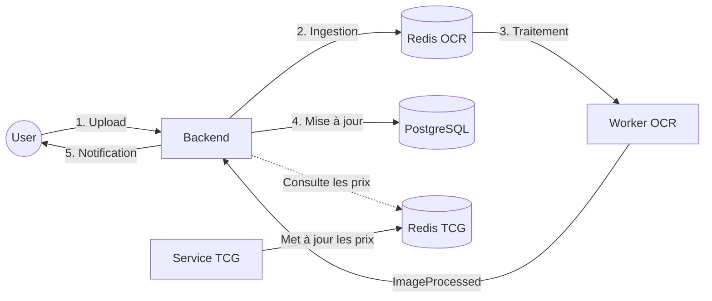

# Architecture Logique - Collectionr (Vision Professionnelle)

---

## 1. Vision globale

Le projet **Collectionr** repose sur une architecture moderne, découplée et orientée événements, conçue pour passer d'un prototype à une plateforme industrielle.

L’architecture est articulée autour de trois principes :

- **Asynchronisme complet** : Les traitements lourds (IA, Scraping) sont déportés dans des workers pour ne jamais bloquer l'expérience utilisateur.
- **Microservices spécialisés** : Chaque composant possède son propre cycle de vie et sa stack technologique adaptée (NestJS pour le métier, Python pour l'IA).
- **Évolutivité (Scale-out)** : Grâce à K3s, chaque brique peut être dupliquée indépendamment selon la charge.

---

## 2. Organisation du code (Clean Architecture)

Pour garantir la portabilité et la maintenabilité, le projet suit les principes de la **Clean Architecture** au sein de ses services (notamment le Backend NestJS) :

- **Domaine (Core)** : Logique métier pure, indépendante de toute technologie.
- **Application** : Cas d'utilisation (ex: "Déclencher un scan", "Valoriser une collection").
- **Infrastructure** : Adaptateurs techniques (Base de données PostgreSQL, APIs externes eBay/Cardmarket, stockage S3).
- **Interface (API)** : Exposition des services via REST et notifications asynchrones.

---

## 3. Les principaux composants

Le système est divisé en blocs fonctionnels autonomes :

- **Frontend** : Interface utilisateur réactive, communiquant avec le Backend via des appels REST et des flux SSE.
- **Backend (NestJS)** : Orchestrateur central, gère la sécurité, les utilisateurs et la persistance des métadonnées via **PostgreSQL**.
- **Worker OCR (Python/YOLO)** : Service spécialisé dans la vision par ordinateur, accédant aux images via un stockage partagé (puis S3 en production).
- **Service TCG (Scraping & APIs)** : Microservice dédié à la veille tarifaire, récupérant les prix en continu sur les places de marché. Il met à jour régulièrement les prix des cartes dans le cache Redis, qui est ensuite consulté par le Backend pour fournir des informations de prix à jour aux utilisateurs.
- **Redis (Broker & Cache)** : 
    - **Broker** : Gère les files d'attente de tâches (`Redis OCR` et `Redis TCG`).
    - **Cache** : Stocke temporairement les prix des cartes pour limiter les appels externes et améliorer les performances.

---

## 4. Flux de données et Communication

Le système utilise une architecture **Event-Driven** (pilotée par les événements) :

1. **Upload** : L'utilisateur envoie une image au Backend.
2. **Ingestion** : L'image est stockée et un `job_id` est poussé dans la file Redis.
3. **Traitement** : Le Worker OCR dépile la tâche, analyse l'image et met à jour le statut en base de données.
4. **Notification (SSE)** : Le Backend informe le client de la fin du traitement via un flux **Server-Sent Events (SSE)**, permettant une mise à jour instantanée de l'interface.

---

## 5. Infrastructure, Observabilité et Sécurité

Le passage à une phase professionnelle impose des standards élevés :

### Stratégie de Stockage
- **Prototype** : Utilisation de **Shared Volumes** Kubernetes pour le partage d'images entre pods.
- **Production** : Migration vers du **Stockage Objet (S3)** compatible (Scaleway/MinIO) pour une durabilité et une scalabilité illimitée.

### Observabilité (Stack PLG)
Suivi proactif de la santé du système via la stack **Prometheus (métriques), Loki (logs) et Grafana (visualisation)**.

### Sécurité & Résilience
- **Gestion des secrets** : Utilisation des **Kubernetes Secrets** (ou Doppler) pour protéger les clés API.
- **Circuit Breaker** : Protection du système contre les défaillances des APIs tierces (TCGPlayer, Cardmarket).
- **Isolation** : Chaque microservice est isolé dans son propre Namespace Kubernetes afin de cloisonner logiquement les ressources, de restreindre les flux réseau inter-services et d'atténuer le rayon d'impact en cas de faille de sécurité.

---

## Conclusion

Cette architecture logique assure la transition fluide du prototype vers une solution commerciale. Elle garantit que **Collectionr** reste une plateforme réactive, capable de gérer des milliers de scans simultanés tout en protégeant l'intégrité et la disponibilité des données.
