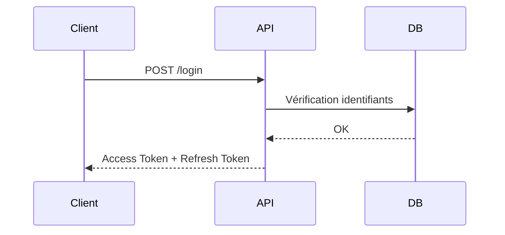
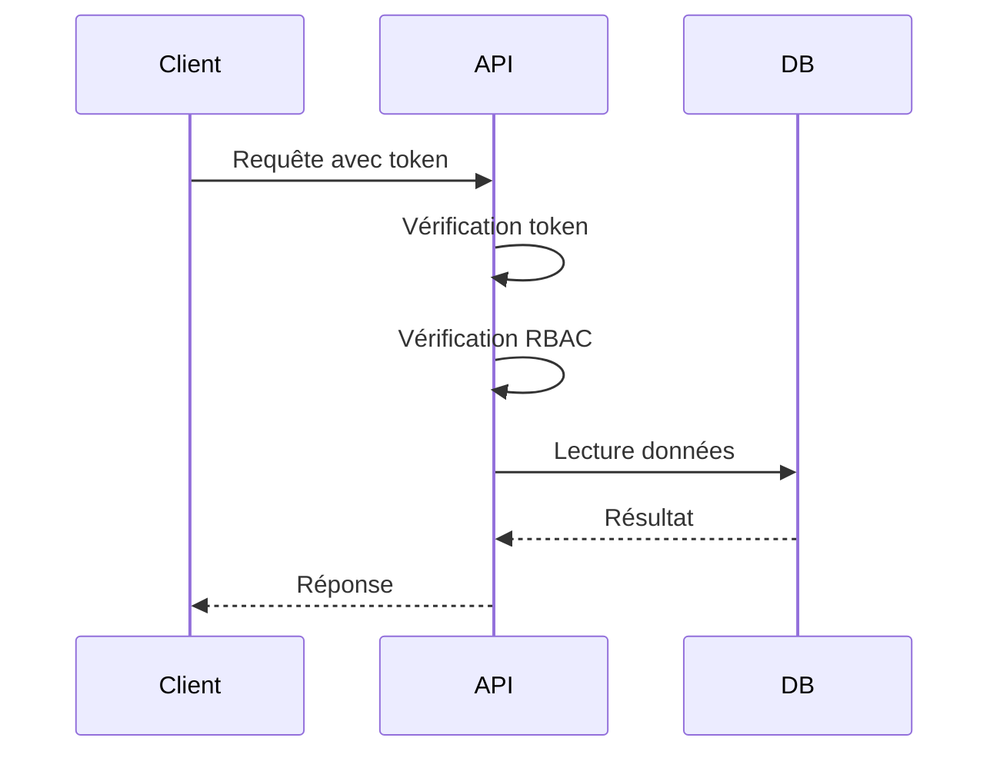
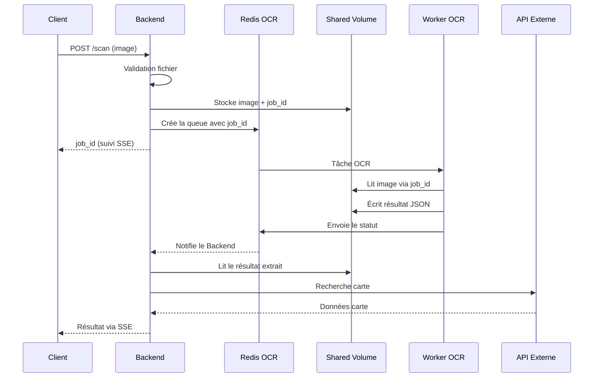
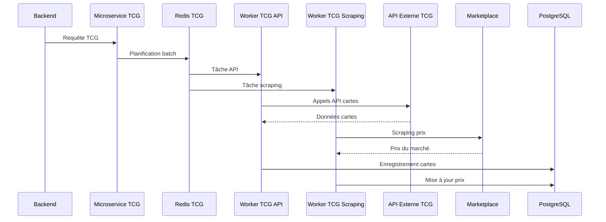

# A3 – Flux techniques plateforme

### Sommaire

1. [Objectif](#1-objectif)
2. [Vue d'ensemble des composants](#2-vue-densemble-des-composants)
3. [Flux d’authentification](#3-flux-dauthentification)
4. [Flux d’accès aux données](#4-flux-daccès-aux-données)
5. [Flux de scan OCR (fonction critique)](#5-flux-de-scan-ocr-fonction-critique)
6. [Flux d’intégration API tierces](#6-flux-dintégration-api-tierces)
7. [Flux de journalisation](#7-flux-de-journalisation)
8. [Flux de gestion des erreurs](#8-flux-de-gestion-des-erreurs)
9. [Points critiques de l’architecture](#9-points-critiques-de-larchitecture)
10. [Cohérence avec les autres documents](#10-cohérence-avec-les-autres-documents)
11. [Évolution future](#11-évolution-future)

---

## 1. Objectif

Ce document décrit les principaux flux techniques de la plateforme CollectionR.

L’objectif est de :

- comprendre les interactions entre les composants
- identifier les points critiques (sécurité, performance, stockage)
- garantir la cohérence avec l’architecture globale

Les flux présentés couvrent les échanges entre les clients (web/mobile), l’API backend, les services internes et la base de données.

---

## 2. Vue d’ensemble des composants

La plateforme repose sur les composants suivants :

- Client web / mobile
- Backend principal (Node.js / NestJS)
- Microservice TCG
- Worker OCR
- Worker TCG API
- Worker TCG Scraping
- Redis OCR et Redis TCG (files d'attente)
- Shared Volume (stockage temporaire OCR)
- Base de données PostgreSQL
- APIs externes TCG et Marketplace
- Connexion SSE (notifications temps réel)

Les échanges entre ces composants sont réalisés via des appels API REST, des files d'attente Redis et des connexions SSE persistantes, le tout orchestré au sein d'un cluster K3s.

---

## 3. Flux d’authentification

### Description

Ce flux permet à un utilisateur de se connecter à la plateforme et d’obtenir un token d’accès.

### Schéma



### Étapes

1. Le client envoie une requête `/login` avec ses identifiants
2. L’API vérifie les informations dans la base de données
3. Si les identifiants sont valides :
   - génération d’un access token (JWT)
   - génération d’un refresh token
4. Les tokens sont renvoyés au client

### Sécurité associée

- mots de passe hashés
- tokens à durée de vie limitée
- rate limiting sur `/login`
- communications internes chiffrées entre Pods K3s
- NetworkPolicies limitant les accès entre services

---

## 4. Flux d’accès aux données

### Description

Ce flux permet à un utilisateur d’accéder à ses données (collection, profil, etc.).

### Schéma


### Étapes

1. Le client envoie une requête avec son token
2. L’API vérifie le token (authentification)
3. L’API vérifie les droits (RBAC)
4. L’API interroge la base de données
5. Les données sont renvoyées au client

### Sécurité associée

- vérification systématique des droits
- protection contre les accès non autorisés (IDOR)
- validation des entrées côté serveur
- isolation réseau entre Pods via NetworkPolicies K3s
- RBAC Kubernetes pour les accès aux ressources du cluster

---

## 5. Flux de scan OCR (fonction critique)

### Description

Ce flux permet à un utilisateur de scanner une carte afin de l’identifier et de l’ajouter à sa collection.
Il constitue un point critique en raison de son impact sur les ressources (CPU, stockage) et de son exposition aux abus via l’endpoint `/scan`.

### Schéma


### Étapes

1. Le client envoie une image via l’endpoint `/scan`
2. L’API valide la requête (authentification, taille, format)
3. L'image est stockée dans le Shared Volume persistant du cluster K3s avec un identifiant unique `job_id`
4. Le service OCR récupère l’image
5. Le service OCR extrait les informations (nom, caractéristiques)
6. L’API utilise ces informations pour interroger une API tierce
7. Les données de la carte sont renvoyées au client
8. Les fichiers temporaires sont supprimés

### Sécurité associée

- validation stricte des fichiers (type, taille)
- limitation des requêtes (rate limiting)
- stockage temporaire uniquement
- suppression automatique des fichiers
- le Shared Volume est accessible uniquement aux Pods autorisés via les PersistentVolumeClaims K3s
- le Worker OCR s'exécute dans un Pod isolé sans accès réseau externe

---

## 6. Flux d'intégration TCG

### Description

Ce flux gère la synchronisation des données cartes et des prix 
via deux workers dédiés, planifiés par le Microservice TCG.

### Schéma



### Étapes

1. Le Backend envoie une requête au Microservice TCG
2. Le Microservice TCG planifie les tâches via Redis TCG
3. Redis TCG distribue deux types de tâches en parallèle :
   - une tâche API vers le Worker TCG API ;
   - une tâche scraping vers le Worker TCG Scraping.
4. Le Worker TCG API interroge l'API externe TCG et récupère 
   les données cartes (nom, extension, caractéristiques)
5. Le Worker TCG Scraping récupère les prix depuis le Marketplace
6. Les deux workers écrivent leurs résultats en base PostgreSQL

### Spécificités

- aucune image n'est stockée localement, seules les URLs sont utilisées ;
- les workers sont des Pods indépendants dans le cluster K3s ;
- le respect des conditions d'utilisation des APIs tierces est obligatoire ;
- un mécanisme de retry est prévu en cas d'échec d'appel externe.

### Sécurité associée

- les clés d'API externes sont stockées dans les Secrets Kubernetes ;
- les workers n'ont pas d'accès réseau entre eux, uniquement via Redis TCG ;
- le rate limiting des APIs tierces est géré côté worker pour éviter les blocages.

---

## 7. Flux de journalisation

### Description

Les événements importants sont enregistrés afin de permettre l’analyse et la détection d’incidents.

### Schéma simplifié

```text
Services → stdout/stderr → kubectl logs → Loki (évolution) → Grafana
```

### Événements concernés

- tentatives de connexion
- erreurs (401, 403, 500)
- requêtes critiques (scan, login)
- actions sensibles

### Fonctionnement

1. chaque service génère des logs (stdout / stderr)
2. Les logs sont accessibles via kubectl logs en environnement K3s, avec une évolution prévue vers Loki + Grafana pour la centralisation.
3. les événements critiques peuvent être analysés

### Référence

Voir document "Logs & Audit" pour plus de détails.

---

## 8. Flux de gestion des erreurs

### Description

Ce flux permet de gérer les erreurs applicatives et techniques.

### Schéma simplifié

```text 
Erreur → Log → Réponse sécurisée
```

### Étapes

1. Une erreur survient (API, OCR, DB)
2. L'erreur est loguée (stdout/stderr → kubectl logs)
3. K3s redémarre automatiquement le Pod défaillant 
   sans intervention humaine
4. Une réponse adaptée est renvoyée au client 
   sans exposer les détails techniques
5. Les erreurs critiques sont surveillées et peuvent 
   déclencher une alerte

### Objectif

- éviter l’exposition d’informations sensibles
- faciliter le diagnostic

---

## 9. Points critiques de l’architecture

Les flux identifiés présentent plusieurs points sensibles pouvant impacter la sécurité, la performance et la disponibilité de la plateforme.

Ces points critiques sont pris en compte dans le document "API Security" afin de définir des mécanismes de protection adaptés.

Les principaux points critiques identifiés sont les suivants :

### 9.1 Endpoint `/scan`

- risque d'abus (nombre de requêtes) ;
- traitement coûteux (OCR) ;
- consommation de stockage temporaire.

Mitigation : rate limiting strict, validation du fichier 
avant stockage, suppression automatique après traitement.

### 9.3 Authentification

- gestion des tokens JWT ;
- protection contre le brute force.

Mitigation : rate limiting sur /login, tokens à durée 
de vie limitée, refresh token sécurisé.

### 9.4 Connexion SSE

- connexion persistante entre le client et le backend ;
- risque de surcharge si trop de connexions simultanées ;
- timeout à gérer.

Mitigation : limite du nombre de connexions simultanées 
par utilisateur, timeout configuré côté serveur.

### 9.5 Microservice TCG

- dépendance aux APIs externes ;
- risque de rate limiting par les APIs tierces ;
- données à synchroniser régulièrement.

Mitigation : mécanisme de retry avec backoff exponentiel, 
cache des données en base PostgreSQL pour limiter 
les appels externes.

---

## 10. Cohérence avec les autres documents

Ce document est lié aux documents suivants :

- API Security : sécurisation des endpoints et des flux
- Logs & Audit : gestion des journaux
- RGPD : gestion des données personnelles

La cohérence entre ces documents est vérifiée à chaque 
évolution de l'architecture. Toute modification d'un flux 
technique doit être répercutée dans les documents associés.

---

## 11. Évolution future

L'architecture de la plateforme repose dès le départ sur K3s comme orchestrateur principal. Les flux techniques décrits dans ce document sont donc conçus nativement pour un environnement Kubernetes et non pensés comme une migration future.
Les flux fonctionnels (authentification, OCR, accès aux données, intégration TCG) restent stables dans leur logique métier. Les évolutions futures concernent uniquement l'infrastructure sous-jacente, sans remise en cause des flux eux-mêmes.

**Court terme — K3s local**

- Les flux s'exécutent dans un cluster K3s local
- Chaque service est déployé sous forme de Pod indépendant
- La résilience est assurée nativement par K3s (redémarrage automatique des Pods)
- Les logs sont accessibles via kubectl, avec une évolution prévue vers Loki + Grafana

**Moyen terme — K3s VPS**

- Les mêmes manifests Kubernetes sont réutilisés sans modification majeure
- Les flux OCR bénéficient de workers répliqués pour absorber les pics de charge
- La centralisation des logs via Loki + Grafana est mise en place
- Le monitoring via Prometheus + Grafana est activé

**Long terme — Kubernetes managé**

- Cette évolution n'est envisagée qu'au-delà de plusieurs dizaines de milliers d'utilisateurs
- Les flux restent identiques, l'infrastructure devient managée par le cloud provider
- L'autoscaling horizontal des workers OCR et IA est activé
- La haute disponibilité est garantie par le control plane managé
