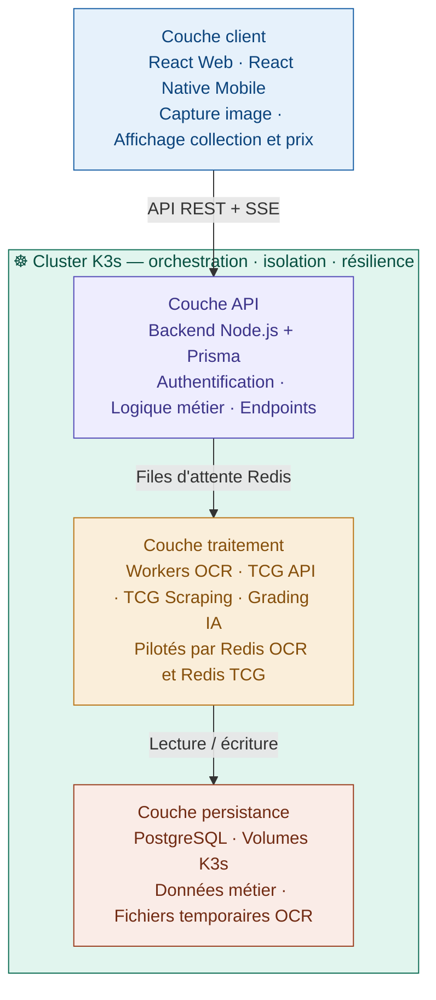

# 00 - Architecture Overview (Vision Globale)

## Sommaire

1. [Contexte et Objectifs](#1-contexte-et-objectifs)
2. [Vision High-Level](#2-vision-high-level)
3. [Grandes Briques Fonctionnelles & Responsabilités](#3-grandes-briques-fonctionnelles--responsabilités)
4. [Choix de l'ORM : Prisma](#4-choix-de-lorm--prisma)
5. [Stratégie Cloud & DevOps](#5-stratégie-cloud--devops)
6. [Principes d'Architecture](#6-principes-darchitecture)
7. [Contraintes & Hypothèses Structurantes](#7-contraintes--hypothèses-structurantes)
8. [Évolution future](#8-évolution-future)
9. [Documents associés](#9-documents-associés)

---

## 1. Contexte et Objectifs
La plateforme vise à révolutionner la gestion de collections de cartes de jeu (**TCG** : Pokémon, Magic, etc.) par une approche "**Digital First**".

* **Objectif principal V1 :** permettre aux collectionneurs 
de numériser instantanément leurs cartes Pokémon via 
une IA de reconnaissance, d'en vérifier l'état et 
d'en suivre la valeur marchande en temps réel.

* **Évolution prévue :** extension à d'autres TCG 
(Yu-Gi-Oh!, Magic, etc.) dans les versions futures.
* **Valeur ajoutée :** Rapidité du scan (multi-cartes), précision de l'expertise (détection de faux/état) et centralisation des données de marché.

Ce projet s'inscrit dans une démarche académique de master, 
avec une ambition de réalisation concrète sur une période 
de dix-huit mois.

---

## 2. Vision High-Level

> Le schéma ci-dessous présente les cinq couches 
> de l'architecture CollectionR orchestrées par K3s.

L'architecture repose sur un écosystème découplé où K3s 
sert de socle d'orchestration pour l'ensemble des services.

Les grandes couches sont les suivantes :

- **Couche client** : applications web et mobile (React / 
  React Native)
- **Couche API** : Backend Node.js exposant les endpoints, 
  gérant l'authentification et la logique métier
- **Couche traitement** : workers asynchrones (OCR, TCG API, 
  TCG Scraping, Grading IA) pilotés par Redis
- **Couche persistance** : PostgreSQL pour les données 
  métier, volumes persistants K3s pour les fichiers 
  temporaires
- **Couche infrastructure** : cluster K3s orchestrant 
  l'ensemble des services

---

## 3. Grandes Briques Fonctionnelles & Responsabilités

Le tableau suivant présente les grandes briques fonctionnelles 
de la plateforme, les technologies retenues et leurs 
responsabilités respectives au sein de l'architecture.

| Couche | Technologie | Responsabilités principales |
|:---|:---|:---|
| Frontend | React / React Native | Interface utilisateur web et mobile, capture d'image, affichage des prix |
| Backend Core | Node.js + NestJS + Prisma | Exposition des APIs, authentification, logique métier, orchestration des workers |
| Microservice TCG | Python + FastAPI | Orchestration des tâches TCG — prix, scraping, prédiction |
| Workers asynchrones | Python (OCR, TCG, Grading IA) | Traitement OCR, scraping marketplace, prédiction de prix, gradation IA || File de messages | Redis OCR + Redis TCG | Découplage Backend → Workers, absorption des pics de charge |
| Persistance | PostgreSQL + Volumes K3s | Données métier, fichiers temporaires OCR |
| Infrastructure | K3s | Orchestration, isolation des namespaces, résilience |
| Observabilité | Prometheus + Grafana + Loki + Promtail | Métriques, logs, alertes |

---

## 4. Choix de l'ORM : Prisma

Le choix de l'ORM conditionne la cohérence et la maintenabilité 
des données sur toute la durée du projet. Voici pourquoi 
Prisma a été retenu comme référence unique.

* **Single Source of Truth :** Le fichier `schema.prisma` définit la structure unique de la base de données.
* **Type-Safety :** Génération automatique des types TypeScript pour le Backend Core, réduisant drastiquement les erreurs de production.
* **Maîtrise des Migrations :** Node.js est l'unique responsable des migrations (`prisma migrate`), assurant que le schéma n'évolue pas de manière anarchique entre les services.

---

## 5. Stratégie Cloud & DevOps

La stratégie Cloud et DevOps repose sur deux principes 
fondamentaux : la portabilité entre fournisseurs cloud 
et la cohérence des environnements du développement 
jusqu'à la production.

### Cloud-Agnostic & Portabilité
Le projet est conçu pour être déployé sur n'importe quel
fournisseur compatible Kubernetes sans modification majeure
des manifests. Les fournisseurs retenus sont Hetzner et
Scaleway (voir `C02-choix-solutions-cloud.md`).
* **Abstraction :** Utilisation de conteneurs Docker pour isoler les dépendances.
* **Infrastructure as Code (IaC) :** les manifests Kubernetes 
sont versionnés dans le dépôt Git. L'utilisation de Terraform 
sera évaluée lors de la phase de réalisation si un déploiement 
cloud managé est envisagé.

### Scénarios de Déploiement

- **Développement local** : cluster K3s local sur les postes 
  de l'équipe (Linux natif, Windows via WSL2, macOS via 
  Rancher Desktop ou OrbStack).
- **Staging** : K3s sur VPS (Hetzner ou Scaleway), 
  mêmes manifests Kubernetes que le local.
- **Production** : K3s VPS multi-nœuds, avec évolution 
  prévue vers Kubernetes managé au-delà de plusieurs 
  dizaines de milliers d'utilisateurs.

Docker Compose peut être utilisé ponctuellement pour 
le debug d'un service isolé mais ne constitue pas 
l'environnement de référence.

---

## 6. Principes d'Architecture

L'architecture suit plusieurs principes structurants qui 
garantissent la maintenabilité, la résilience et 
l'évolutivité de la plateforme dans le temps.

* **Modularité :** communication entre Node.js et Python via API REST interne. Redis est utilisé comme broker de messages pour les traitements asynchrones (OCR, TCG, Grading IA).
* **Découplage de la Donnée :** le service Python accède aux données en lecture seule ou via des APIs dédiées pour ne pas interférer avec le cycle de vie géré par Prisma.
* **Résilience :** système de file d'attente (Queue) pour les scans d'images afin d'absorber les pics de charge sans bloquer l'interface utilisateur.

---

## 7. Contraintes & Hypothèses Structurantes

Cette section liste les contraintes et hypothèses 
structurantes qui ont orienté les choix d'architecture. 
Elles constituent le cadre de référence pour toute 
décision technique future.

### Sécurité & Données
- Chiffrement des données en transit et au repos.
- Gestion centralisée des secrets.
- Aucune image de carte n'est stockée côté plateforme : seules les URLs externes (issues du catalogue TCGdex) sont conservées en base pour l'affichage dans les collections utilisateurs (décision actée, cohérente avec `S04-rgpd-conformite.md`).

Deux types de traitement d'image sont distingués :

- **Images de collection** : uniquement une référence URL externe en base (`CARD.imageUrl`), aucun stockage ni cache d'image côté plateforme. En cas d'URL cassée/indisponible, l'image est simplement absente côté affichage.
- **Images de traitement OCR** (temporaires) : images 
  brutes uploadées pour le pipeline de scan, stockées transitoirement dans un volume partagé K3s et supprimées 
  automatiquement après traitement (< 24h).

### Gestion des images & Flux IA
- Les images capturées sont transmises au service IA via API.
- Aucune volumétrie long terme n’est engagée à ce stade pour les images.

### Contraintes API & Rate Limiting
- Les services IA sont soumis à des **quotas et limites de taux** imposés par les fournisseurs.
- L’architecture intègre un mécanisme de **file d’attente et de régulation** afin :
  - d’absorber les pics de demandes,
  - de protéger les APIs IA,
  - de maîtriser les coûts.
- Le système est conçu pour refuser ou différer proprement les requêtes en cas de dépassement de quota.

### Coûts & Modèle de Consommation
- Les services IA reposent sur un modèle **pay-as-you-go**.
- Les tests actuels restent dans les **quotas gratuits** des fournisseurs.
- Toute montée en charge au-delà de ces quotas entraîne mécaniquement des coûts.
- L’architecture vise donc une **maîtrise du risque financier** via :
  - limitation volontaire des appels IA,
  - activation ciblée des traitements,
  - absence de ressources IA actives en continu.

---

## 8. Évolution future

L'architecture est pensée dès le départ pour évoluer 
progressivement sans rupture technique majeure, 
en suivant la croissance de la plateforme et 
de sa base d'utilisateurs.

- **Court terme** : prototype fonctionnel sur K3s local 
  avec les fonctionnalités V1 (scan OCR, collection, 
  prix Pokémon).
- **Moyen terme** : déploiement K3s VPS. Le Worker TCG Prediction y est ajouté dès la phase Beta (différenciateur V1 confirmé par le CDC v4.0, pas une fonctionnalité V2). Le Worker Grading IA, lui, reste une fonctionnalité bonus post-V1.
- **Long terme** : migration vers Kubernetes managé 
  si la plateforme dépasse plusieurs dizaines de 
  milliers d'utilisateurs actifs.

  ## 9. Documents associés

- `A01-architecture-logique.md`
- `A02-flux-techniques.md`
- `A03-architecture-runtime.md`
- `C01-principe-cloud.md`
- `C02-choix-solutions-cloud.md`
- `D01-environnement.md`
- `D02-cicd.md`
- `D03-strategie-test.md`
- `D04-observabilite-slo.md`
- `S01-principes-securite.md`
