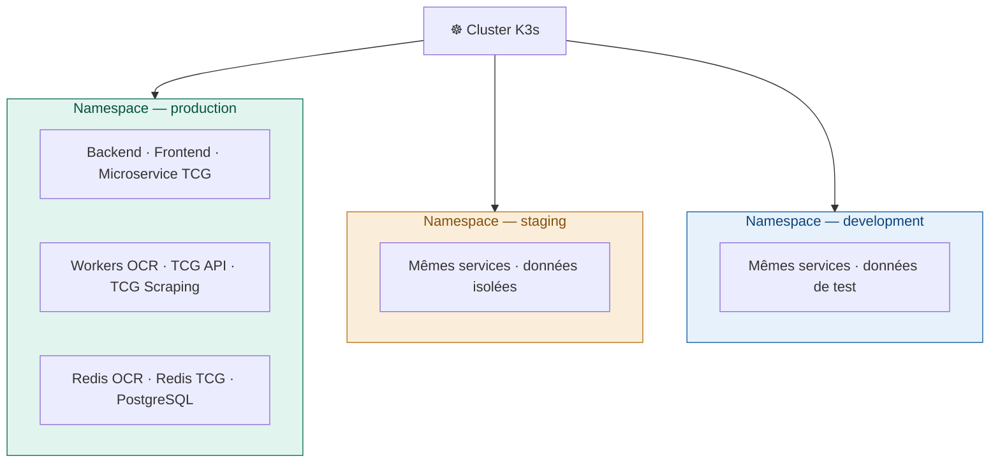
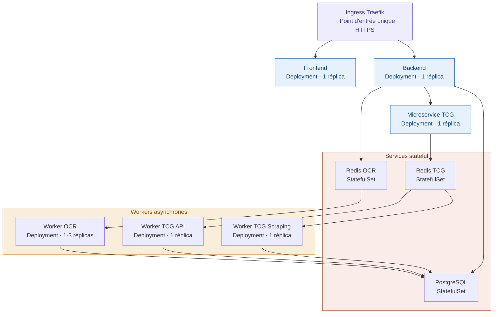
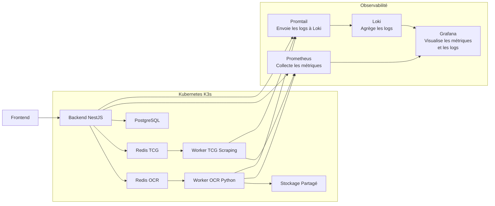
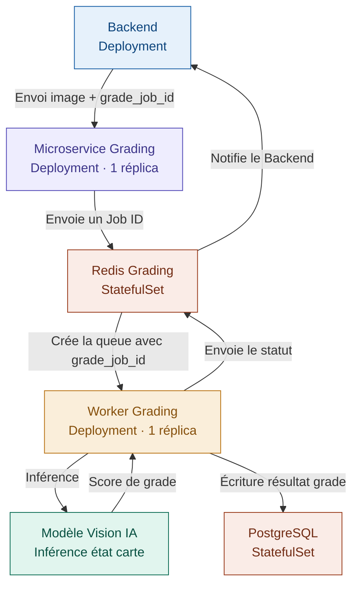
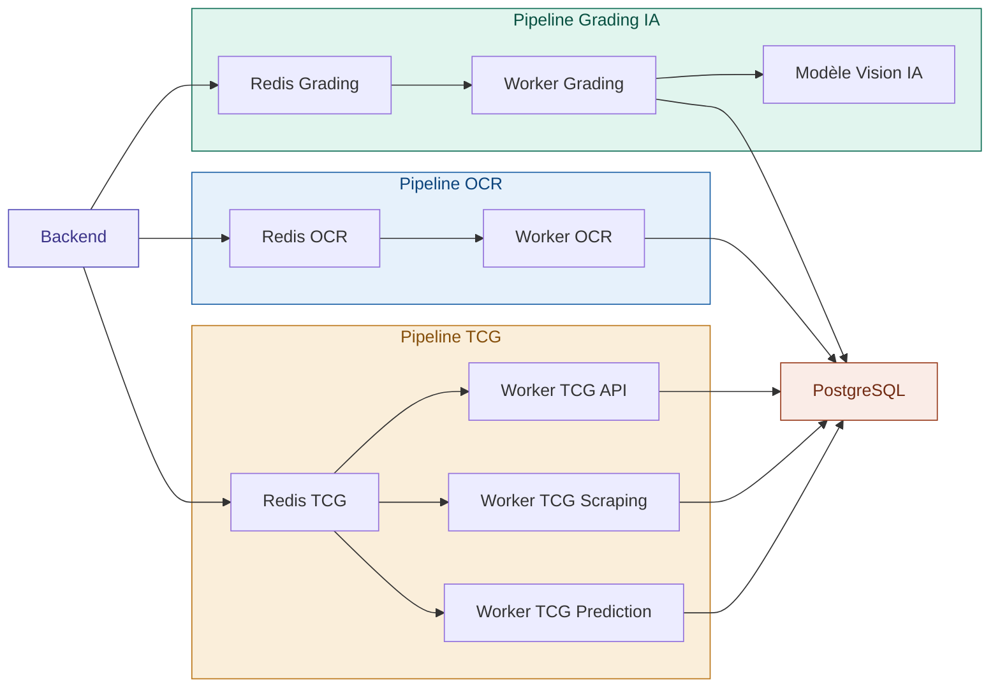
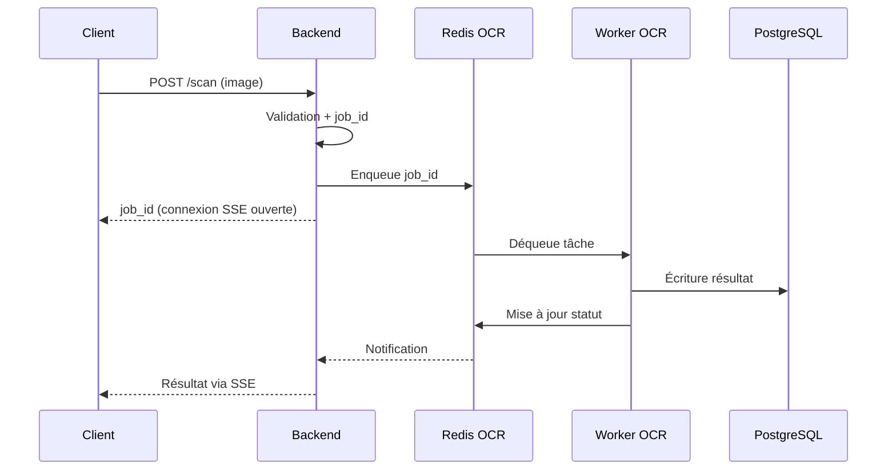
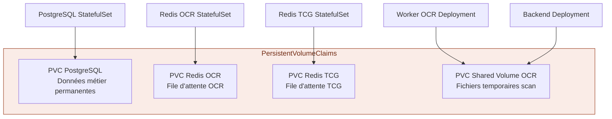

# A4 — Architecture Runtime

## Sommaire

1. [Objectif](#1-objectif)
2. [Périmètre](#2-périmètre)
3. [Organisation du cluster K3s](#3-organisation-du-cluster-k3s)
4. [Déploiement des services](#4-déploiement-des-services)
5. [Communication entre services](#5-communication-entre-services)
6. [Gestion des ressources](#6-gestion-des-ressources)
7. [Résilience et redémarrage automatique](#7-résilience-et-redémarrage-automatique)
8. [Stockage persistant](#8-stockage-persistant)
9. [Sécurité runtime](#9-sécurité-runtime)
10. [Évolution future](#10-évolution-future)
11. [Documents associés](#11-documents-associés)

---

## 1. Objectif

Ce document décrit l'architecture runtime de la plateforme 
CollectionR, c'est-à-dire la manière dont les services 
s'exécutent concrètement au sein du cluster K3s.

Il complète le document A2 (architecture logique) en 
précisant comment les composants sont déployés, comment 
ils communiquent entre eux en conditions réelles et 
quelles ressources leur sont allouées.

L'objectif est de :

- décrire l'organisation du cluster K3s par namespace ;
- définir les ressources allouées à chaque service ;
- préciser les mécanismes de communication inter-services ;
- documenter la stratégie de résilience et de redémarrage ;
- garantir la cohérence entre les environnements local, 
  staging et production.

---

## 2. Périmètre

Ce document couvre l'ensemble des composants déployés 
dans le cluster K3s :

- Frontend Deployment
- Backend Deployment
- Microservice TCG
- Worker OCR
- Worker TCG API
- Worker TCG Scraping
- Worker TCG Prediction (V2)
- Worker Grading IA (V2)
- Redis OCR et Redis TCG
- PostgreSQL
- Shared Volume (stockage temporaire OCR)
- Ingress Controller (Traefik)

Les détails d'implémentation applicative (code métier, 
algorithmes IA) sont hors périmètre.

---

## 3. Organisation du cluster K3s

Le cluster K3s est organisé en namespaces distincts afin 
d'isoler les environnements et les responsabilités. 
Cette séparation garantit qu'aucun service d'un 
environnement ne peut interagir avec un autre 
sans autorisation explicite.

### 3.1 Namespaces



### 3.2 Règles d'isolation

Les règles suivantes s'appliquent à tous les namespaces :

- aucune donnée de production n'est utilisée en 
  développement ou en staging ;
- les secrets sont distincts par namespace ;
- les pipelines CI/CD n'ont accès qu'au namespace cible ;
- les NetworkPolicies limitent les communications 
  inter-namespaces.

---

## 4. Déploiement des services

Chaque service est déployé sous forme de ressource 
Kubernetes adaptée à sa nature. Le tableau suivant 
précise le type de déploiement retenu pour chaque 
composant et la justification associée.

| Service | Type K3s | Réplicas | Justification |
|---|---|---|---|
| Frontend | Deployment | 1 (extensible) | Stateless, scalable horizontalement |
| Backend | Deployment | 1 (extensible) | Stateless, scalable horizontalement |
| Microservice TCG | Deployment | 1 | Orchestration des tâches TCG |
| Worker OCR | Deployment | 1-3 | Scalable selon charge OCR |
| Worker TCG API | Deployment | 1 | Appels API externes |
| Worker TCG Scraping | Deployment | 1 | Scraping Marketplace |
| Worker TCG Prediction | Deployment | 1 | V2 — inférence prix |
| Worker Grading IA | Deployment | 1 | V2 — gradation carte |
| Redis OCR | StatefulSet | 1 | Stateful — file d'attente OCR |
| Redis TCG | StatefulSet | 1 | Stateful — file d'attente TCG |
| PostgreSQL | StatefulSet | 1 | Stateful — données persistantes |

### 4.1 Vue d'ensemble des déploiements

Le schéma suivant représente l'ensemble des Pods 
déployés dans le cluster et leurs relations :


Le schéma suivant complète la vue précédente en y ajoutant
la couche d'observabilité déployée dans le cluster :



### 4.2 Pipeline Grading IA (V2)

Le pipeline Grading IA constitue un pipeline indépendant 
du pipeline OCR. Il est déclenché par le Backend via 
un Microservice Grading dédié et repose sur un modèle 
de Vision IA pour évaluer l'état physique de la carte.



Ce pipeline suit la même logique asynchrone que le 
pipeline OCR :

- le Backend envoie l'image avec un identifiant unique 
  `grade_job_id` au Microservice Grading ;
- le Microservice Grading planifie la tâche via 
  Redis Grading ;
- le Worker Grading récupère la tâche, soumet l'image 
  au Modèle Vision IA et récupère le score de grade ;
- le résultat est écrit en base PostgreSQL et le 
  Backend est notifié via Redis Grading ;
- le client reçoit le résultat via la connexion SSE 
  déjà ouverte avec le Backend.

### 4.3 Vue complète V2 — tous les pipelines

En V2, les trois pipelines coexistent dans le cluster 
K3s de manière indépendante. Une panne sur le pipeline 
Grading n'impacte pas le pipeline OCR, et inversement.



---

## 5. Communication entre services

Les services communiquent entre eux selon trois modes 
distincts selon la nature de l'échange. Cette séparation 
garantit que les traitements lourds n'impactent jamais 
les réponses API standards.

### 5.1 Modes de communication

| Mode | Technologie | Utilisé pour |
|---|---|---|
| Synchrone | API REST HTTP | Backend ↔ Frontend, Backend ↔ Microservice TCG |
| Asynchrone | Redis (file d'attente) | Backend → Workers OCR et TCG |
| Temps réel | SSE (Server-Sent Events) | Backend → Client (notifications job_id) |

### 5.2 Flux de communication runtime



### 5.3 Résolution des noms de services

Au sein du cluster K3s, chaque service est accessible 
via son nom DNS interne Kubernetes. Aucune adresse IP 
n'est utilisée en dur dans les configurations.

Exemples de noms DNS internes :

- `backend-service.production.svc.cluster.local`
- `redis-ocr.production.svc.cluster.local`
- `postgresql.production.svc.cluster.local`

---

## 6. Gestion des ressources

La définition des limites de ressources par Pod est
essentielle pour garantir la stabilité du cluster.
Sans limites définies, un Worker OCR sous charge pourrait
consommer toute la mémoire disponible et provoquer
un OOMKill sur les autres Pods.

### 6.1 Limites par service

Les valeurs suivantes sont calibrées pour l'environnement
de développement local, y compris sur les postes à 8 Go
de RAM. Elles seront ajustées lors des tests de charge
en staging.

| Service | CPU request | CPU limit | RAM request | RAM limit |
|---|---|---|---|---|
| Frontend | 25m | 100m | 64Mi | 128Mi |
| Backend NestJS | 50m | 300m | 128Mi | 256Mi |
| Microservice TCG | 50m | 200m | 128Mi | 256Mi |
| Worker OCR Python | 100m | 400m | 256Mi | 512Mi |
| Worker TCG Scraping | 50m | 200m | 128Mi | 256Mi |
| Redis OCR | 25m | 100m | 64Mi | 128Mi |
| Redis TCG | 25m | 100m | 64Mi | 128Mi |
| PostgreSQL | 100m | 300m | 256Mi | 512Mi |

> **Total estimé :** ~800m requests / ~1,7 Go requests RAM —
> raisonnable sur 8 Go. Le profil `--light` (voir `D01-environnement.md`
> section 2.4) permet de réduire davantage l'empreinte mémoire
> en ne démarrant que les composants nécessaires.

### 6.2 Exemple de configuration YAML

Chaque manifest Kubernetes doit inclure un bloc `resources`
explicite. Sans ce bloc, K3s alloue à la volée et peut
provoquer un OOMKill sans avertissement.

```yaml
resources:
  requests:
    memory: "128Mi"
    cpu: "50m"
  limits:
    memory: "256Mi"
    cpu: "200m"
```

Les valeurs ci-dessus correspondent au Backend NestJS.
Adapter selon le composant en se référant au tableau 6.1.

### 6.3 Unités de mesure

Pour rappel, les unités utilisées dans Kubernetes sont
les suivantes :

- **m** (millicores) : 1000m = 1 CPU. Un service à
  250m utilise un quart de CPU au maximum.
- **Mi** (mebibytes) : unité de mémoire. 512Mi ≈ 537 Mo.
- **Gi** (gibibytes) : 1Gi ≈ 1,07 Go.
---

## 7. Résilience et redémarrage automatique

K3s gère nativement la résilience des services. 
Cette section décrit les mécanismes en place pour 
garantir la continuité de service en cas de panne 
d'un composant.

### 7.1 Politique de redémarrage

Tous les Pods utilisent la politique `restartPolicy: Always`. 
En cas de crash, K3s recrée automatiquement le Pod 
défaillant sans intervention humaine.

Le tableau suivant précise le comportement attendu 
en cas de panne de chaque composant :

| Composant | Impact en cas de panne | Récupération |
|---|---|---|
| Worker OCR | Jobs en attente dans Redis OCR | Automatique — Pod recréé par K3s |
| Worker TCG API | Tâches TCG en attente | Automatique — Pod recréé par K3s |
| Worker TCG Scraping | Scraping différé | Automatique — Pod recréé par K3s |
| Redis OCR | File d'attente OCR indisponible | Automatique — StatefulSet recréé |
| Redis TCG | File d'attente TCG indisponible | Automatique — StatefulSet recréé |
| PostgreSQL | API en erreur 503 | Automatique — StatefulSet recréé |
| Backend | Frontend en erreur | Automatique — Deployment recréé |

### 7.2 Probes de santé

Des probes Kubernetes sont définies pour chaque service 
afin de détecter les pannes et les états dégradés :

- **Liveness probe** : vérifie que le service est vivant. 
  Si elle échoue, K3s redémarre le Pod.
- **Readiness probe** : vérifie que le service est prêt 
  à recevoir du trafic. Si elle échoue, K3s retire le 
  Pod du load balancer sans le redémarrer.

---

## 8. Stockage persistant

La gestion du stockage est un point critique de 
l'architecture runtime. Deux types de stockage 
coexistent dans le cluster selon la durée de vie 
et la sensibilité des données.

### 8.1 Volumes persistants



### 8.2 Règles de gestion du stockage

Les règles suivantes s'appliquent à tous les volumes :

- les données PostgreSQL sont sauvegardées régulièrement 
  via un CronJob K3s ;
- le Shared Volume OCR est nettoyé automatiquement 
  après chaque traitement ;
- aucun fichier temporaire ne doit persister plus de 
  24 heures dans le Shared Volume ;
- les PVC sont nommés explicitement pour éviter toute 
  confusion entre environnements.

---

## 9. Sécurité runtime

La sécurité en conditions d'exécution repose sur 
plusieurs couches complémentaires appliquées directement 
au niveau du cluster K3s.

### 9.1 NetworkPolicies

Les NetworkPolicies définissent quels Pods peuvent 
communiquer entre eux. Par défaut, toute communication 
non explicitement autorisée est refusée.

Règles principales :

- le Backend peut contacter Redis OCR, Redis TCG 
  et PostgreSQL ;
- les Workers ne peuvent pas contacter le Frontend ;
- le Worker OCR n'a pas accès au réseau externe ;
- les Workers TCG API et Scraping peuvent contacter 
  les APIs externes uniquement.

### 9.2 RBAC Kubernetes

Les accès au cluster sont définis via RBAC. Chaque 
membre de l'équipe dispose uniquement des permissions 
nécessaires à son rôle :

| Rôle | Permissions |
|---|---|
| Développeur Backend | Lecture logs Backend et Workers |
| Développeur IA | Lecture logs Workers OCR et Grading |
| Cloud / DevOps | Accès complet au cluster |
| Pipeline CI/CD | Deploy uniquement sur le namespace cible |

### 9.3 Secrets

Aucun secret n'est stocké en clair dans les manifests 
Kubernetes ou le dépôt Git. Les secrets sont injectés 
via les Secrets Kubernetes en local et staging, avec 
une évolution prévue vers Vault en production.

---

## 10. Évolution future

L'architecture runtime est conçue pour évoluer 
progressivement sans réécriture des manifests existants.

**Court terme — K3s local**
- Cluster mono-nœud sur les postes de l'équipe ;
- manifests Kubernetes versionnés dans le dépôt Git ;
- logs consultables via kubectl logs.

**Moyen terme — K3s VPS**
- Déploiement des mêmes manifests sur VPS 
  (Hetzner ou Scaleway) ;
- mise en place du monitoring Prometheus + Grafana ;
- centralisation des logs via Loki + Promtail ;
- activation des alertes via AlertManager ;
- réplication des Workers OCR selon la charge.

**Long terme — Kubernetes managé**
- Migration vers EKS, GKE ou AKS si la plateforme 
  dépasse plusieurs dizaines de milliers d'utilisateurs ;
- activation de l'autoscaling horizontal (HPA) 
  sur les Workers OCR et Grading IA ;
- haute disponibilité garantie par le control plane managé ;
- les manifests K3s sont compatibles sans modification 
  majeure.

---

## 11. Documents associés

- `A00-overview.md`
- `A01-architecture-logique.md`
- `A02-flux-techniques.md`
- `S01-principes-securite.md`
- `S05-logs-audit.md`
- `D01-environnement.md`
- `D04-observabilite-slo.md`
