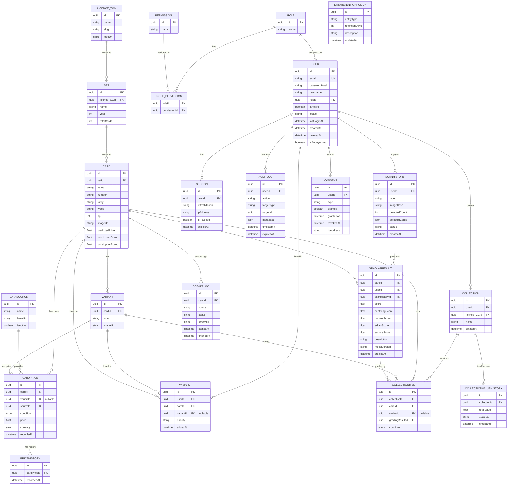

# Schéma DB — TCG App

## Diagramme

```mermaid
erDiagram
    LICENCE_TCG ||--o{ SET : contains
    SET ||--o{ CARD : contains
    CARD ||--o{ VARIANT : has
    CARD ||--o{ CARDPRICE : "has price"
    DATASOURCE ||--o{ CARDPRICE : provides
    CARDPRICE ||--o{ PRICEHISTORY : "has history"
    ROLE ||--o{ ROLE_PERMISSION : has
    PERMISSION ||--o{ ROLE_PERMISSION : "assigned to"
    ROLE ||--o{ USER : assigned_to
    VARIANT ||--o{ CARDPRICE : "has price"
    USER ||--o{ SESSION : has
    USER ||--o{ COLLECTION : creates
    USER ||--o{ AUDITLOG : performs
    USER ||--o{ SCANHISTORY : triggers
    USER ||--o{ WISHLIST : "listed in"
    USER ||--o{ CONSENT : grants
    COLLECTION ||--o{ COLLECTIONITEM : includes
    COLLECTION ||--o{ COLLECTIONVALUEHISTORY : "tracks value"
    CARD ||--o{ COLLECTIONITEM : "is in"
    VARIANT ||--o{ COLLECTIONITEM : uses
    VARIANT ||--o{ WISHLIST : "listed in"
    CARD ||--o{ WISHLIST : "listed in"
    SCANHISTORY ||--o{ GRADINGRESULT : produces
    GRADINGRESULT ||--o{ COLLECTIONITEM : "graded by"
    CARD ||--o{ GRADINGRESULT : "graded"
    CARD ||--o{ SCRAPELOG : "scrape logs"

    LICENCE_TCG {
        uuid id PK
        string name
        string slug
        string logoUrl
    }

    ROLE {
        uuid id PK
        string name
    }

    PERMISSION {
        uuid id PK
        string name
    }

    ROLE_PERMISSION {
        uuid roleId FK
        uuid permissionId FK
    }

    USER {
        uuid id PK
        string email UK
        string passwordHash
        string username
        uuid roleId FK
        boolean isActive
        string locale
        datetime lastLoginAt
        datetime createdAt
        datetime deletedAt
        boolean isAnonymized
    }

    CONSENT {
        uuid id PK
        uuid userId FK
        string type
        boolean granted
        datetime grantedAt
        datetime revokedAt
        string ipAddress
    }

    SESSION {
        uuid id PK
        uuid userId FK
        string refreshToken
        string ipAddress
        boolean isRevoked
        datetime expiresAt
    }

    SET {
        uuid id PK
        uuid licenceTCGId FK
        string name
        int year
        int totalCards
    }

    CARD {
        uuid id PK
        uuid setId FK
        string name
        string number
        string rarity
        string types
        int hp
        string imageUrl
        float predictedPrice
        float priceLowerBound
        float priceUpperBound
    }

    VARIANT {
        uuid id PK
        uuid cardId FK
        string label
        string imageUrl
    }

    DATASOURCE {
        uuid id PK
        string name
        string baseUri
        boolean isActive
    }

    CARDPRICE {
        uuid id PK
        uuid cardId FK
        uuid variantId FK "nullable"
        uuid sourceId FK
        enum condition
        float price
        string currency
        datetime recordedAt
    }

    PRICEHISTORY {
        uuid id PK
        uuid cardPriceId FK
        datetime recordedAt
    }

    COLLECTION {
        uuid id PK
        uuid userId FK
        uuid licenceTCGId FK
        string name
        datetime createdAt
    }

    COLLECTIONITEM {
        uuid id PK
        uuid collectionId FK
        uuid cardId FK
        uuid variantId FK "nullable"
        uuid gradingResultId FK
        enum condition
    }

    COLLECTIONVALUEHISTORY {
        uuid id PK
        uuid collectionId FK
        float totalValue
        string currency
        datetime timestamp
    }

    WISHLIST {
        uuid id PK
        uuid userId FK
        uuid cardId FK
        uuid variantId FK "nullable"
        string priority
        datetime addedAt
    }

    SCANHISTORY {
        uuid id PK
        uuid userId FK
        string type
        string imageHash
        int detectedCount
        json detectedCards
        string status
        datetime createdAt
    }

    GRADINGRESULT {
        uuid id PK
        uuid cardId FK
        uuid userId FK
        uuid scanHistoryId FK
        float score
        float centeringScore
        float cornersScore
        float edgesScore
        float surfaceScore
        string description
        string modelVersion
        datetime createdAt
    }

    AUDITLOG {
        uuid id PK
        uuid userId FK
        string action
        string targetType
        uuid targetId
        json metadata
        datetime timestamp
        datetime expiresAt
    }

    SCRAPELOG {
        uuid id PK
        uuid cardId FK
        string source
        string status
        string errorMsg
        datetime startedAt
        datetime finishedAt
    }

    DATARETENTIONPOLICY {
        uuid id PK
        string entityType
        int retentionDays
        string description
        datetime updatedAt
    }
```