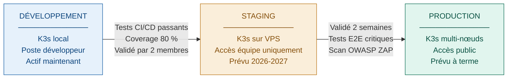
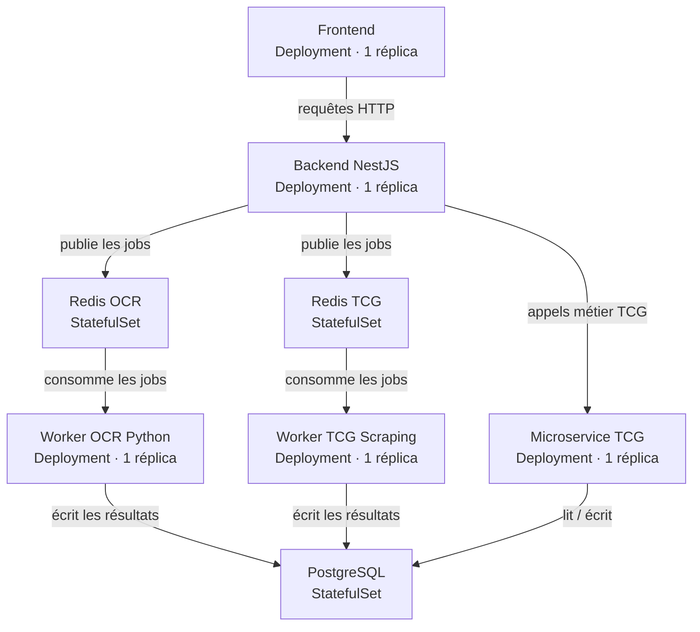

# Environnements — CollectionR

Ce document décrit la stratégie d'environnements de la
plateforme CollectionR. Il définit les trois niveaux
d'environnement prévus, leur configuration, leur isolation
et les règles qui s'appliquent à chacun d'eux.

Cette stratégie est conçue pour être progressive et réaliste :
seul l'environnement de développement local est actif à ce
stade. Les environnements staging et production sont documentés
comme évolutions prévues lors de la phase de réalisation
(année 2026-2027).

Elle est cohérente avec les documents suivants :
- `D02-cicd.md` — pipeline de déploiement par environnement ;
- `A03-architecture-runtime.md` — namespaces et organisation
  du cluster K3s ;
- `C02-choix-solutions-cloud.md` — stratégie d'hébergement ;
- `S01-principes-securite.md` — isolation et séparation
  des environnements ;
- `D04-observabilite-slo.md` — stratégie d'observabilité
  (Prometheus, Grafana, Loki, Promtail).

---

## Sommaire

1. [Vue d'ensemble](#1-vue-densemble)
2. [Environnement de développement local](#2-environnement-de-développement-local)
3. [Environnement de staging](#3-environnement-de-staging)
4. [Environnement de production](#4-environnement-de-production)
5. [Isolation et règles communes](#5-isolation-et-règles-communes)
6. [Configuration matérielle de l'équipe](#6-configuration-matérielle-de-léquipe)
7. [Évolution future](#7-évolution-future)
8. [Documents associés](#8-documents-associés)

---

## 1. Vue d'ensemble

La plateforme CollectionR est organisée en trois environnements
distincts, chacun correspondant à une étape de maturité du projet.
Cette séparation garantit qu'aucune donnée réelle n'est exposée
pendant le développement et que chaque étape est validée avant
de passer à la suivante.

Le schéma suivant illustre la progression des environnements,
du poste local jusqu'à la production. Les manifests Kubernetes
sont identiques à chaque étape : seules les valeurs de
configuration (secrets, URLs, ressources allouées) changent
d'un environnement à l'autre.



L'environnement de staging est prévu pour la phase de réalisation
(2026-2027). Il ne sera activé que lorsque les critères de qualité
définis en section 3.3 seront atteints en développement.

---

## 2. Environnement de développement local

L'environnement de développement est le seul environnement
actif à ce stade du projet. Il tourne sur les postes
de chaque membre de l'équipe et permet de développer,
tester et démontrer la plateforme sans aucun coût
d'infrastructure.

### 2.1 Caractéristiques

| Caractéristique | Valeur |
|---|---|
| Infrastructure | K3s local sur poste développeur |
| Namespace K3s | `development` |
| Coût | 0 € |
| Données | Données fictives uniquement |
| Accès | Local uniquement — pas d'exposition Internet |
| Secrets | Secrets Kubernetes locaux |
| Logs | `kubectl logs` + Stern |
| Observabilité | Optionnelle en local — Prometheus + Grafana si besoin |

> **Note observabilité locale :** la stack Prometheus/Grafana/Loki/Promtail
> peut être déployée en local à des fins de développement, mais elle reste
> optionnelle à ce stade. Elle sera systématiquement activée en staging
> et production. Voir `D04-observabilite-slo.md`.

### 2.2 Organisation du namespace development

Le schéma suivant décrit les composants déployés dans le namespace
`development` et leurs relations. Le frontend appelle le backend,
qui orchestre les microservices métier. Les workers consomment
leurs files Redis respectives et écrivent leurs résultats en base.



### 2.3 Compatibilité multi-OS

L'équipe travaille sur trois systèmes d'exploitation
différents. K3s s'adapte à chacun via des couches
de compatibilité natives. L'environnement de référence
et de production reste **Linux**.

| OS | Méthode | Outil |
|---|---|---|
| Linux | K3s natif | kubectl |
| Windows 10/11 | K3s via WSL2 | kubectl dans WSL2 |
| macOS Apple Silicon et Intel | K3s via Rancher Desktop ou OrbStack | kubectl |

> **Note ARM64 :** les membres de l'équipe disposant d'un poste
> macOS Apple Silicon doivent utiliser des images Docker compatibles
> ARM64. Toutes les images du projet sont construites en
> multi-architecture (amd64 + arm64) via les pipelines CI/CD
> pour garantir la compatibilité.

> **Note WSL2 :** l'utilisation de K3s sous Windows nécessite
> WSL2 configuré au préalable. La procédure d'installation est
> documentée dans le repo `collectionr-devops`.

> **Note RAM :** voir section 6 pour les contraintes
> spécifiques aux postes avec 8 Go de RAM.

## 2.4 Lancement en une commande

L'objectif est qu'un nouveau membre puisse lancer
l'ensemble de la plateforme en une seule commande,
quel que soit son OS. Les scripts de setup sont
disponibles dans le repo `collectionr-devops` :

```bash
# Linux
./scripts/setup-local.sh

# Windows (dans WSL2)
./scripts/setup-wsl2.sh

# macOS
./scripts/setup-macos.sh
```

Un profil allégé est disponible via le flag `--light`, recommandé
sur les postes avec 8 Go de RAM ou lorsqu'on travaille sur une
feature spécifique sans avoir besoin de toute la stack. Il démarre uniquement les composants
nécessaires à la feature en cours de développement et exclut
l'observabilité locale :

```bash
./scripts/setup-local.sh --light
```

Le profil `--light` démarre par défaut : Backend, PostgreSQL, Redis TCG
et Worker TCG. Les autres composants (Worker OCR, Redis OCR, Frontend)
peuvent être ajoutés manuellement selon le besoin.

---

## 3. Environnement de staging

L'environnement de staging est prévu pour la phase
de réalisation (2026-2027). Il sera déployé sur un
VPS partagé accessible à toute l'équipe et servira
à valider les fonctionnalités avant leur mise en
production.

### 3.1 Caractéristiques

| Caractéristique | Valeur |
|---|---|
| Infrastructure | K3s sur VPS (Hetzner ou Scaleway) |
| Namespace K3s | `staging` |
| Coût estimé | 20-40 € / mois |
| Données | Données de test proches de la réalité |
| Accès | Équipe uniquement — pas d'exposition publique |
| Secrets | Secrets Kubernetes distincts du développement |
| Logs | Loki + Promtail |
| Métriques | Prometheus + Grafana |

### 3.2 Fournisseurs VPS envisagés

Le choix du fournisseur sera arrêté lors de la phase de réalisation.
Les trois options ci-dessous ont été présélectionnées sur la base
d'un benchmark coût / localisation RGPD / configuration disponible.
Tous les fournisseurs sont localisés dans l'Union Européenne,
garantissant la conformité RGPD.

| Fournisseur | Localisation | Configuration | Prix estimé |
|---|---|---|---|
| Hetzner | Allemagne / Finlande | 4 vCPU / 8 Go RAM | 15-25 € / mois |
| Scaleway | France | 4 vCPU / 8 Go RAM | 20-30 € / mois |
| OVH | France | 4 vCPU / 8 Go RAM | 20-35 € / mois |

### 3.3 Critères de passage develop → staging

Un environnement de staging n'a de valeur que si
les critères de qualité minimaux sont atteints sur
la branche `develop`. Le passage en staging est
conditionné par :

- tous les tests unitaires et d'intégration passent en CI/CD ;
- le coverage atteint les seuils définis par périmètre
  (voir `D03-strategie-test.md` section 4) ;
- les tests d'infrastructure K3s sont validés ;
- au moins deux membres de l'équipe ont validé
  les fonctionnalités en local.

---

## 4. Environnement de production

L'environnement de production est prévu à terme,
lorsque la plateforme sera suffisamment mature
pour accueillir de vrais utilisateurs. Il ne sera
mis en place que lorsque les environnements de
développement et staging seront pleinement validés.

### 4.1 Caractéristiques

| Caractéristique | Valeur |
|---|---|
| Infrastructure | K3s VPS multi-nœuds ou K8s managé |
| Namespace K3s | `production` |
| Coût estimé | 140-350 € / mois (K3s VPS) |
| Données | Données utilisateurs réelles |
| Accès | Public — exposition Internet via Traefik |
| Secrets | Vault|
| Logs | Loki + Promtail |
| Métriques | Prometheus + Grafana + AlertManager |
| SLA cible | 99,9 % de disponibilité |

### 4.2 Critères de passage staging → production

Ces critères sont plus stricts que pour le passage en staging :
ils garantissent qu'aucune régression fonctionnelle ou faille
de sécurité n'atteint les utilisateurs réels.

Le passage en production est conditionné par :

- validation complète en staging sur au moins deux semaines ;
- tests E2E critiques (Login + Scan) passants ;
- scan de sécurité OWASP ZAP sans vulnérabilité critique ;
- stratégie de backup PostgreSQL en place ;
- procédure de rollback testée et documentée.

---

## 5. Isolation et règles communes

L'isolation entre environnements est une exigence
de sécurité non négociable.

### 5.1 Règles d'isolation

Les règles suivantes s'appliquent à tous les environnements
sans exception.

- aucune donnée de production n'est utilisée
  en développement ou en staging ;
- les secrets sont distincts par environnement —
  un secret de développement ne fonctionne jamais
  en production ;
- les namespaces K3s sont strictement isolés
  via des NetworkPolicies ;
- les pipelines CI/CD n'ont accès qu'au namespace
  cible de leur déploiement.

### 5.2 Gestion des secrets par environnement

| Environnement | Outil | Remarque |
|---|---|---|
| Développement | Secrets Kubernetes locaux | Jamais de secrets en clair dans Git |
| Staging | Secrets Kubernetes sur VPS | Rotation régulière recommandée |
| Production | Vault | Audit des accès tracé et journalisé |

### 5.3 Variables de configuration

Chaque environnement dispose de son propre fichier
de configuration via des ConfigMaps Kubernetes distincts.
Les variables suivantes changent par environnement :

- URL de la base de données PostgreSQL ;
- URL des Redis OCR et TCG ;
- niveau de log (`DEBUG` en dev, `INFO` en staging et production) ;
- limites de ressources CPU et mémoire par Pod ;
- activation ou désactivation des fonctionnalités en cours de
  développement via des **feature flags** : variables d'environnement
  booléennes (ex. `FEATURE_SCAN_OCR=true`) permettant de déployer
  du code non finalisé sur staging sans l'exposer aux utilisateurs.
  En développement, les feature flags peuvent être activés librement ;
  en staging, ils sont désactivés par défaut sauf validation explicite
  de l'équipe.

### 5.4 Stack d'observabilité par environnement

La stack d'observabilité retenue est **Prometheus + Grafana + Loki + Promtail**,
déployée dans K3s pour tous les environnements. Aucune solution externe
(ELK, Datadog, New Relic, Netbox ou autre) n'est utilisée : la stack
est 100 % open source, auto-hébergée et sans coût de licence.

| Composant | Rôle | Dev | Staging | Production |
|---|---|---|---|---|
| Prometheus | Collecte des métriques | Optionnel | ✓ | ✓ |
| Grafana | Visualisation métriques et logs | Optionnel | ✓ | ✓ |
| Loki | Agrégation des logs | Optionnel | ✓ | ✓ |
| Promtail | Envoi des logs vers Loki | Optionnel | ✓ | ✓ |
| AlertManager | Alertes | ✗ | Optionnel | ✓ |

Le détail de la configuration (dashboards, SLO, alertes) est documenté
dans `D04-observabilite-slo.md`.

---

## 6. Configuration matérielle de l'équipe

L'équipe travaille sur des postes Linux, macOS (Apple Silicon et Intel)
et Windows 10/11. Les postes disposent de 8 à 16 Go de RAM.

> **Note RAM :** un poste avec 8 Go de RAM peut faire tourner la stack
> locale mais nécessite de limiter les ressources des pods via
> `resources.limits` et de ne pas démarrer tous les composants
> simultanément. Le profil `--light` est recommandé dans ce cas
> (voir section 2.4).

La compatibilité de chaque configuration avec K3s est détaillée
en section 2.3. Tout nouveau membre rejoignant le projet doit pouvoir
lancer l'environnement local depuis son propre poste : les scripts
de setup couvrent les trois systèmes d'exploitation et la procédure
d'onboarding est disponible dans le repo `collectionr-devops`.

---

## 7. Évolution future

La stratégie d'environnements suit la même progression
que l'infrastructure K3s définie dans `C02-choix-solutions-cloud.md`.

**Court terme — phase actuelle**

- K3s local sur les postes de l'équipe ;
- namespace `development` uniquement actif ;
- observabilité optionnelle en local (`kubectl logs` + Stern) ;
- scripts de setup disponibles dans `collectionr-devops`.

**Moyen terme — phase de réalisation (2026-2027)**

- déploiement du namespace `staging` sur VPS Hetzner ou Scaleway ;
- activation de la stack Prometheus + Grafana + Loki + Promtail ;
- mise en place des alertes via AlertManager (optionnel en staging).

**Long terme — mise en production**

- déploiement du namespace `production` sur K3s VPS multi-nœuds
  ou K8s managé ;
- migration des secrets vers Vault ;
- AlertManager activé et SLA 99,9 % monitoré via Grafana.

---

## 8. Documents associés

- `A00-overview.md`
- `A03-architecture-runtime.md`
- `C01-principe-cloud.md`
- `C02-choix-solutions-cloud.md`
- `D02-cicd.md`
- `D03-strategie-test.md`
- `D04-observabilite-slo.md`
- `S01-principes-securite.md`
- `S05-logs-audit.md`
