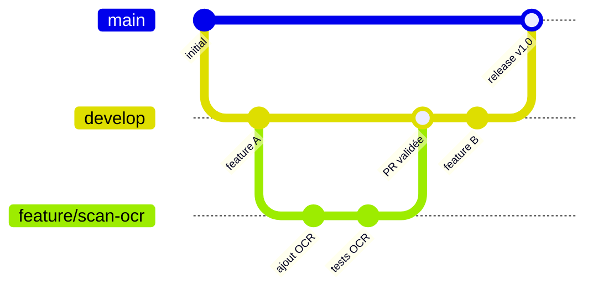
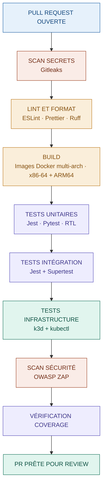
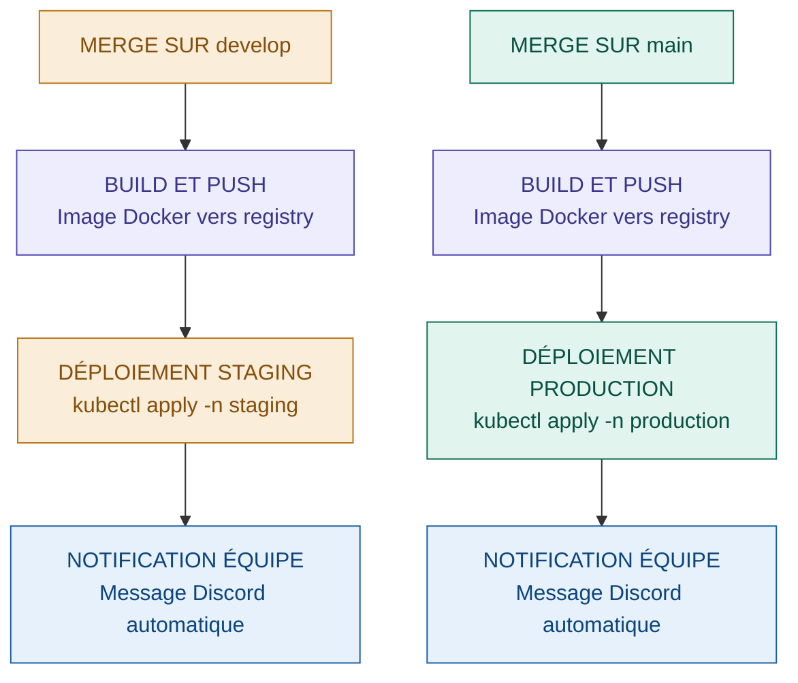

# CI/CD — CollectionR

Ce document définit la stratégie d'intégration continue 
et de déploiement continu (CI/CD) de la plateforme 
CollectionR. Il décrit les pipelines GitHub Actions, 
les règles de protection des branches et le processus 
de déploiement par environnement.

La CI/CD est la responsabilité principale de l'équipe 
Cloud. Elle garantit que chaque modification de code 
est automatiquement testée, validée et déployée sans 
intervention manuelle, réduisant ainsi les risques 
d'erreur humaine.

Elle est cohérente avec les documents suivants :
- `D01-environnement.md` — environnements cibles 
  des déploiements ;
- `D03-strategie-test.md` — tests exécutés dans 
  la pipeline ;
- `A03-architecture-runtime.md` — manifests K3s 
  déployés ;
- `S01-principes-securite.md` — règles de sécurité 
  appliquées à la pipeline.

---

## Sommaire

1. [Principes généraux](#1-principes-généraux)
2. [Organisation des branches](#2-organisation-des-branches)
3. [Pipeline CI — Intégration continue](#3-pipeline-ci--intégration-continue)
4. [Pipeline CD — Déploiement continu](#4-pipeline-cd--déploiement-continu)
5. [Règles de protection des branches](#5-règles-de-protection-des-branches)
6. [Gestion des secrets dans la pipeline](#6-gestion-des-secrets-dans-la-pipeline)
7. [Rollback](#7-rollback)
8. [Évolution future](#8-évolution-future)
9. [Documents associés](#9-documents-associés)

---

## 1. Principes généraux

La stratégie CI/CD repose sur les principes suivants :

- **Automatisation systématique :** aucun déploiement 
  manuel en staging ou production — tout passe 
  par la pipeline ;
- **Fail fast :** si un test échoue, la pipeline 
  s'arrête immédiatement et le merge est bloqué ;
- **Cohérence des environnements :** les mêmes 
  manifests Kubernetes sont utilisés dans les trois 
  environnements, seules les valeurs de configuration 
  changent ;
- **Sécurité intégrée :** les scans de secrets 
  et de sécurité font partie intégrante de la pipeline, 
  pas une étape optionnelle ;
- **Traçabilité :** chaque déploiement est tracé 
  et associé à une Pull Request et un auteur identifié.

---

## 2. Organisation des branches

La stratégie de branches est simple et adaptée 
à une équipe étudiante. Elle garantit que la branche 
principale reste toujours stable et déployable.

Le schéma suivant illustre le cycle de vie d'une fonctionnalité,
depuis la création de la branche jusqu'au déploiement en production.



### 2.1 Branches principales

| Branche | Rôle | Protection |
|---|---|---|
| `main` | Code stable — déployé en production | 🔴 Protégée — merge uniquement via PR validée |
| `staging` | Environnement pré-prod permanent pour validation et tests | 🔴 Protégée — merge uniquement via PR validée |
| `develop` | Intégration des features — déployé en staging | 🟡 Protégée — merge uniquement via PR |
| `feature/*` | Développement d'une fonctionnalité | 🟢 Libre — créée par le développeur |
| `fix/*` | Correction de bug | 🟢 Libre — créée par le développeur |
| `devops/*` | Modifications infra et manifests K3s | 🟢 Libre — créée par l'équipe Cloud |

La branche `staging` est une branche permanente pour la pré-production et les tests. Elle possède le même niveau de sécurité que `main` et n'est accessible qu'à un nombre restreint de membres de l'équipe pour validation avant le déploiement en production.


### 2.2 Règles de nommage des branches

Pour maintenir une cohérence dans le dépôt, 
les branches doivent respecter le format suivant :

```
feature/nom-de-la-feature
fix/description-du-bug
devops/modification-infra
```

Exemples :
- `feature/scan-carte-pokemon`
- `fix/token-expiration`
- `devops/networkpolicy-worker-ocr`

---

## 3. Pipeline CI — Intégration continue

La pipeline CI s'exécute automatiquement à chaque 
Pull Request, quelle que soit la branche cible. 
Elle vérifie que le code est correct, sécurisé 
et que les tests passent avant tout merge.

### 3.1 Vue d'ensemble



### 3.2 Détail des étapes

Chaque étape de la pipeline a un rôle précis. 
Si l'une d'elles échoue, les étapes suivantes 
ne s'exécutent pas — c'est le principe **fail fast**.

**Étape 1 — Scan des secrets (Gitleaks)**

Avant toute chose, la pipeline vérifie qu'aucun 
secret n'est présent en clair dans le code, 
les manifests Kubernetes ou les fichiers de configuration.

- aucune clé API en clair ;
- aucun mot de passe en clair ;
- aucun token en clair.

Si un secret est détecté, la pipeline s'arrête 
immédiatement et le développeur est notifié.

---

**Étape 2 — Lint et formatage**

La qualité du code est vérifiée automatiquement 
pour garantir une base de code lisible et cohérente :

- **ESLint + Prettier** : Backend Node.js et Frontend React ;
- **Ruff** : API Python IA (linter et formateur rapide).

---

**Étape 3 — Build des images Docker**

Les images Docker sont construites en 
**multi-architecture (x86-64 + ARM64)** pour garantir 
la compatibilité avec l'ensemble des postes de l'équipe, 
notamment le poste macOS Apple M4 Pro.

Cette étape vérifie également que toutes les 
dépendances sont correctement déclarées et que 
les images se construisent sans erreur.

---

**Étape 4 — Tests unitaires**

Les tests unitaires vérifient le comportement 
de chaque fonction ou composant isolément :

- **Jest** : Backend Node.js et Frontend React ;
- **Pytest** : API Python IA ;
- **React Testing Library** : composants React 
  avec état ou appel API.

---

**Étape 5 — Tests d'intégration**

Les tests d'intégration vérifient que les services 
communiquent correctement entre eux :

- **Jest + Supertest** : endpoints API Backend ;
- communication Backend → Redis → Worker ;
- communication Backend → PostgreSQL.

---

**Étape 6 — Tests d'infrastructure K3s**

Un cluster K3s temporaire est créé via **k3d** 
pour valider les manifests Kubernetes :

- validation des fichiers YAML (`kubectl dry-run`) ;
- démarrage correct de tous les Pods ;
- communication inter-services ;
- respect des NetworkPolicies ;
- montage des volumes persistants.

Le cluster k3d est détruit automatiquement 
après les tests.

---

**Étape 7 — Scan de sécurité OWASP ZAP**

OWASP ZAP effectue un scan automatique des endpoints 
API à la recherche des failles OWASP Top 10. 
Il s'exécute contre une instance temporaire 
de l'application lancée dans k3d.

---

**Étape 8 — Vérification du coverage**

Le coverage est vérifié pour chaque périmètre technique.
Si l'un des seuils ci-dessous n'est pas atteint, la pipeline
échoue et le merge est bloqué.

| Périmètre | Seuil minimum |
|---|---|
| Backend | 70% |
| Python Microservice | 50% |
| Frontend | 40% |

Les seuils de coverage diffèrent selon les périmètres techniques. Les tests E2E compensent le seuil plus bas pour le Frontend.

---

## 4. Pipeline CD — Déploiement continu

La pipeline CD s'exécute automatiquement après 
un merge validé. Elle déploie les manifests K3s 
mis à jour sur l'environnement cible.

### 4.1 Vue d'ensemble

Le schéma suivant illustre le déclenchement du déploiement
selon la branche cible du merge. Chaque environnement dispose
de sa propre séquence de déploiement et de notification.




### 4.2 Déploiement par environnement

| Événement | Environnement cible | Commande |
|---|---|---|
| Merge sur `develop` | Staging | `kubectl apply -n staging` |
| Merge sur `main` | Production | `kubectl apply -n production` |

> **Note phase actuelle :** le déploiement automatique 
> en staging et production n'est pas encore actif 
> car aucun serveur n'est disponible à ce stade. 
> La pipeline CD sera activée lors de la phase 
> de réalisation (2026-2027).

### 4.3 Notifications

Chaque déploiement déclenche une notification automatique sur le canal 
Discord de l'équipe via Webhook. Discord permet de générer une URL 
Webhook depuis les paramètres d'un canal en quelques minutes. Cette URL 
est stockée comme secret GitHub Actions (`DISCORD_WEBHOOK_URL`) et 
appelée automatiquement en fin de pipeline via un simple appel HTTP.

La notification indique :
- l'environnement déployé (staging / production) ;
- la branche source et le numéro de PR ;
- l'auteur du merge ;
- le statut du déploiement (succès / échec).

Exemple de step GitHub Actions :

```yaml
- name: Notification Discord
  run: |
    curl -X POST ${{ secrets.DISCORD_WEBHOOK_URL }} \
    -H "Content-Type: application/json" \
    -d '{
      "content": "Déploiement staging terminé — PR #${{ github.event.pull_request.number }} mergée par ${{ github.actor }}"
    }'
```

---

## 5. Règles de protection des branches

Les branches `main` et `develop` sont protégées 
via les règles de protection GitHub. Ces règles 
garantissent qu'aucun code non validé ne peut 
être mergé directement.

### 5.1 Règles appliquées à `main` et `develop`

- Pull Request obligatoire avant tout merge;
- au moins une review approuvée obligatoire;
- tous les checks CI/CD doivent être au vert;
- la branche doit être à jour avec la cible avant merge;
- push direct interdit, même pour les admins;
- force push interdit.

### 5.2 Processus de merge complet

```mermaid
graph LR
    Dev["DÉVELOPPEUR\nCrée feature/*"] --> PR["PULL REQUEST\nOuverte"]
    PR --> CI["PIPELINE CI\nS'exécute"]
    CI --> Review["CODE REVIEW\nPar un collègue"]
    Review --> Approve["APPROBATION\nReview validée"]
    Approve --> Merge["MERGE\nAutorisé"]
    Merge --> CD["PIPELINE CD\nDéploiement auto"]

    style Dev fill:#E6F1FB,stroke:#185FA5,color:#0C447C
    style PR fill:#EEEDFE,stroke:#534AB7,color:#3C3489
    style CI fill:#FAEEDA,stroke:#BA7517,color:#854F0B
    style Review fill:#FAEEDA,stroke:#BA7517,color:#854F0B
    style Approve fill:#E1F5EE,stroke:#0F6E56,color:#085041
    style Merge fill:#E1F5EE,stroke:#0F6E56,color:#085041
    style CD fill:#E1F5EE,stroke:#0F6E56,color:#085041
```



---

## 6. Gestion des secrets dans la pipeline

Les secrets nécessaires à la pipeline (credentials 
de déploiement, tokens, clés API) ne sont jamais 
stockés en clair dans le code. Ils sont gérés 
via **GitHub Actions Secrets**, accessibles 
uniquement par la pipeline.

### 6.1 Secrets GitHub Actions configurés

Le tableau suivant liste les secrets configurés dans GitHub Actions
et leur périmètre d'utilisation.

| Secret | Usage | Environnement |
|---|---|---|
| `KUBECONFIG_STAGING` | Accès au cluster K3s staging | Staging |
| `KUBECONFIG_PROD` | Accès au cluster K3s production | Production |
| `DISCORD_WEBHOOK_URL` | Notifications Discord | Tous |
| `REGISTRY_TOKEN` | Push des images Docker | Tous |

### 6.2 Règles de sécurité

- aucun secret n'est affiché dans les logs 
  de la pipeline ;
- les secrets de production ne sont accessibles 
  qu'aux pipelines déclenchées sur `main` ;
- les secrets sont rotés régulièrement 
  et audités par l'équipe Cloud.

---

## 7. Rollback

En cas de problème après un déploiement, 
une procédure de rollback est prévue pour 
revenir rapidement à la version précédente 
sans interruption prolongée du service.

### 7.1 Rollback automatique

K3s conserve l'historique des déploiements via le mécanisme natif
de Kubernetes. En cas de problème détecté après un déploiement,
le rollback s'effectue en deux commandes :

```bash
# Rollback du Backend vers la version précédente
kubectl rollout undo deployment/backend -n production

# Vérification du statut
kubectl rollout status deployment/backend -n production
```

### 7.2 Rollback via Helm (évolution future)

Lorsque Helm sera mis en place pour la gestion 
des manifests, le rollback sera encore plus simple :

```bash
helm rollback collectionr 1 -n production
```

### 7.3 Critères de déclenchement du rollback

Un rollback est déclenché automatiquement ou 
manuellement dans les cas suivants :

- la Liveness Probe échoue sur plus de 50% 
  des Pods après déploiement ;
- le taux d'erreur 5xx dépasse 5% dans les 
  5 minutes suivant le déploiement ;
- une alerte critique est remontée via 
  AlertManager ou Discord.

---

## 8. Évolution future

La stratégie CI/CD évolue en parallèle 
de l'infrastructure et des environnements.

**Court terme — phase actuelle**
- pipeline CI active sur tous les repos 
  dès le début du développement ;
- scan Gitleaks + tests unitaires + intégration 
  + infrastructure K3s + coverage ;
- notifications Discord via Webhook ;
- pipeline CD en mode dry-run uniquement 
  (pas de vrai déploiement sans serveur).

**Moyen terme — phase de réalisation (2026-2027)**
- activation de la pipeline CD vers staging 
  (Hetzner ou Scaleway) ;
- ajout des tests E2E Playwright dans la pipeline 
  (scénarios Login + Scan) ;
- intégration d'OWASP ZAP complète ;
- mise en place de Helm pour la gestion 
  des manifests et le rollback simplifié.

**Long terme — production**
- activation de la pipeline CD vers production ;
- déploiement blue/green pour zéro interruption 
  de service ;
- audit de sécurité de la pipeline avant 
  ouverture publique.

---

## 9. Documents associés

- `D01-environnement.md`
- `D03-strategie-test.md`
- `A03-architecture-runtime.md`
- `S01-principes-securite.md`
- `S02-threat-model.md`
- `B01-benchmark-k3s.md`
