# Stratégie de test — CollectionR

Ce document définit la stratégie de test de la plateforme 
CollectionR. Il couvre les types de tests retenus, les outils 
associés, les objectifs de couverture et l'intégration dans 
la pipeline CI/CD.

Cette stratégie est conçue pour être réaliste au regard du 
rythme de travail de l'équipe (1 jour par semaine, rendu avril 
2027) tout en garantissant un niveau de qualité suffisant pour 
une mise en production progressive.

Elle est cohérente avec les documents suivants :
- `D02-cicd.md` — pipeline d'exécution automatique des tests ;
- `A03-architecture-runtime.md` — Liveness et Readiness Probes ;
- `D04-observabilite-slo.md` — objectifs de performance à valider 
  par les tests de charge ;
- `S02-threat-model.md` — menaces à couvrir par les tests de sécurité.

---

## Sommaire

1. [Principes généraux](#1-principes-généraux)
2. [Types de tests retenus](#2-types-de-tests-retenus)
3. [Outils retenus](#3-outils-retenus)
4. [Objectifs de couverture](#4-objectifs-de-couverture)
5. [Règle PR obligatoire](#5-règle-pr-obligatoire)
6. [Tests E2E](#6-tests-e2e)
7. [Tests de sécurité](#7-tests-de-sécurité)
8. [Tests d'infrastructure K3s](#8-tests-dinfrastructure-k3s)
9. [Intégration CI/CD](#9-intégration-cicd)
10. [Évolution future](#10-évolution-future)
11. [Documents associés](#11-documents-associés)

---

## 1. Principes généraux

La stratégie de test repose sur les principes suivants :

- **Qualité sur la quantité :** mieux vaut des tests ciblés 
  sur le code critique qu'une couverture artificielle 
  de 100% sans valeur réelle ;
- **Tests au plus tôt :** toute nouvelle fonctionnalité 
  doit inclure ses tests dans la même Pull Request — 
  pas de merge sans tests associés ;
- **Automatisation systématique :** tous les tests sont 
  exécutés automatiquement via GitHub Actions à chaque 
  Pull Request ;
- **Réalisme :** les objectifs définis sont atteignables 
  avec le rythme de l'équipe et seront réévalués 
  à chaque sprint si nécessaire.

---

## 2. Types de tests retenus

Quatre types de tests sont retenus comme socle obligatoire. 
Chacun couvre un niveau différent de l'architecture et 
répond à des besoins spécifiques.

### 2.1 Tests unitaires

Les tests unitaires vérifient le comportement d'une fonction 
ou d'un composant isolément, sans dépendance externe.

**Périmètre :**
- fonctions métier du Backend (calcul de prix, validation 
  des données, logique d'authentification) ;
- fonctions utilitaires de l'API Python IA (traitement 
  d'image, scoring) ;
- composants React isolés (Frontend).

**Quand les écrire :**
Dans la même Pull Request que la fonctionnalité associée, 
sans exception.

---

### 2.2 Tests d'intégration

Les tests d'intégration vérifient que plusieurs composants 
fonctionnent correctement ensemble. Ils sont particulièrement 
critiques dans une architecture microservices comme la nôtre, 
où de nombreux services communiquent entre eux.

**Périmètre :**
- endpoints API Backend (requête HTTP → réponse attendue) ;
- communication Backend → Redis OCR → Worker OCR ;
- communication Backend → PostgreSQL (lecture et écriture) ;
- pipeline TCG (Microservice TCG → Redis TCG → Workers).

**Quand les écrire :**
À chaque nouvelle route API ou nouveau flux inter-services.

---

### 2.3 Tests d'infrastructure K3s

Les tests d'infrastructure vérifient que les manifests 
Kubernetes sont valides et que les services démarrent 
correctement dans le cluster K3s. Ils constituent 
la responsabilité principale de l'équipe Cloud.

**Périmètre :**
- validité des manifests Kubernetes (Deployments, 
  Services, ConfigMaps, Secrets) ;
- démarrage correct de tous les Pods ;
- communication inter-services via les Services Kubernetes ;
- respect des NetworkPolicies (isolation des Pods) ;
- montage correct des volumes persistants.

**Quand les écrire :**
À chaque modification d'un manifest Kubernetes.

---

### 2.4 Tests de sécurité

Les tests de sécurité vérifient que les failles identifiées 
dans le Threat Model sont bien couvertes. Ils complètent 
les contrôles définis dans le document API Sécurité.

**Périmètre :**
- scan automatique des endpoints API (OWASP Top 10) ;
- vérification du rate limiting sur les endpoints sensibles 
  (`/login`, `/register`, `/scan`) ;
- détection des headers de sécurité HTTP manquants ;
- vérification de l'absence de secrets en clair 
  dans les images Docker.

**Quand les lancer :**
Automatiquement dans la pipeline CI/CD à chaque 
Pull Request vers la branche principale.

---

## 3. Outils retenus

Le choix des outils est guidé par trois critères : 
la compatibilité avec la stack technique existante, 
la gratuité et la facilité de prise en main pour 
une équipe étudiante.

| Type de test | Outil | Justification |
|---|---|---|
| Unitaires Backend | Jest | Standard Node.js, intégré NestJS, gratuit |
| Unitaires IA | Pytest | Standard Python, simple et documenté |
| Unitaires Frontend | Jest + React Testing Library | Intégré à React, gratuit |
| Intégration Backend | Jest + Supertest | Permet de tester les endpoints HTTP directement |
| Infrastructure K3s | k3d + kubectl | Crée un cluster K3s léger dans Docker pour les tests |
| E2E | Playwright | Plus moderne que Cypress, gratuit, multi-navigateur |
| Sécurité | OWASP ZAP | Référence open source pour les scans de sécurité API |

---

## 4. Objectifs de couverture

Les objectifs de couverture sont définis par périmètre 
et non sur l'ensemble du code. Cette approche garantit 
que les efforts de test sont concentrés là où ils 
ont le plus de valeur.

| Périmètre | Coverage cible | Justification |
|---|---|---|
| Code métier critique Backend | 70% minimum | Routes API, auth, logique OCR — zone à risque élevé |
| API Python IA | 50% minimum | Code IA plus complexe à tester unitairement |
| Frontend React | 40% minimum | Les E2E compensent le manque de tests unitaires |
| Code utilitaire / helpers | Pas de seuil | Faible risque, coût de test élevé |

Ces seuils sont vérifiés automatiquement via GitHub Actions 
à chaque Pull Request. Une PR dont le coverage descend 
en dessous du seuil cible est bloquée jusqu'à correction.

> **Note :** Les seuils définis reflètent une approche pragmatique 
> adaptée au rythme de l'équipe (1 jour par semaine, rendu avril 2027) 
> et concentrent les efforts de test là où le risque métier est 
> le plus élevé. Un coverage à 100% n'est ni un objectif réaliste 
> ni un indicateur de qualité suffisant — il donnerait une fausse 
> impression de sécurité tout en ralentissant le développement. 
> Ces seuils seront réévalués à chaque sprint selon les retours 
> de l'équipe.

---

## 5. Règle PR obligatoire

Afin d'éviter l'accumulation de dette technique sur 
les tests, la règle suivante s'applique à l'ensemble 
de l'équipe sans exception :

> **Toute nouvelle route, fonctionnalité ou modification 
> de manifest K3s doit inclure ses tests dans la même 
> Pull Request. Aucun merge ne sera autorisé sans 
> tests associés.**

Cette règle est appliquée automatiquement via les 
règles de protection de branche GitHub :
- coverage vérifié par GitHub Actions ;
- au moins une review approuvée obligatoire ;
- tous les checks CI/CD doivent être au vert.

### 5.1 Quand écrire des tests

**Tests obligatoires :**
- nouvelle route API (NestJS ou FastAPI) ;
- nouvelle logique métier (authentification, OCR, 
  calcul de prix, état React) ;
- nouveau composant React avec état ou appel API ;
- modification d'un manifest K3s.

**Tests non requis :**
- classes Tailwind uniquement (style pur) ;
- texte et traductions ;
- assets (images, icônes) ;
- documentation.

**Règle du "et" — cas limite :**
Si une Pull Request mélange du Tailwind avec de la 
logique métier, c'est la logique qui prime et les 
tests sont obligatoires.

---

## 6. Tests E2E

Les tests E2E simulent un vrai utilisateur interagissant 
avec l'application de bout en bout. Ils sont plus longs 
à maintenir que les tests unitaires mais très impactants 
pour la démonstration finale.

### 6.1 Scénarios retenus

Les scénarios E2E simulent le parcours complet d'un 
utilisateur réel dans l'application, de l'interface 
jusqu'à la base de données. Ils sont exécutés 
automatiquement par Playwright sans intervention humaine.

Quatre scénarios ont été validés par l'équipe :

| Priorité | Scénario | Description |
|---|---|---|
| 🔴 Critique | Login / Logout | L'utilisateur se connecte avec ses identifiants et se déconnecte |
| 🔴 Critique | Scan et ajout collection | L'utilisateur scanne une carte Pokémon et elle apparaît dans sa collection |
| 🟡 Important | Consultation collection | L'utilisateur consulte sa collection et voit les prix |

### 6.2 Calendrier d'implémentation

Les tests E2E ne seront pas implémentés dès le début 
du développement. Ils nécessitent que le Frontend 
et le Backend soient suffisamment stables pour 
ne pas casser à chaque modification.

- **Phase de développement V1** : pas de E2E — 
  focus sur les tests unitaires et d'intégration ;
- **Fin de beta** : implémentation des scénarios 
  Login et Scan (priorité critique) ;
- **Début V1 stable** : ajout des scénarios Consultation 
  et Partage.

### 6.3 Responsabilité

L'implémentation des scénarios E2E est à la charge 
des équipes Frontend et Backend. L'équipe Cloud 
est responsable de l'intégration de Playwright 
dans la pipeline GitHub Actions.

---

## 7. Tests de sécurité

Les tests de sécurité sont directement liés aux menaces 
identifiées dans le Threat Model et aux exigences 
définies dans le document API Sécurité.

### 7.1 Scans OWASP ZAP

OWASP ZAP effectue un scan automatique des endpoints 
API à la recherche des failles les plus courantes 
(OWASP Top 10). Il est intégré dans la pipeline 
CI/CD et s'exécute automatiquement à chaque 
Pull Request vers la branche principale.

**Failles couvertes :**
- injection SQL et NoSQL ;
- exposition de données sensibles ;
- mauvaise configuration des headers de sécurité ;
- absence de rate limiting ;
- tokens mal configurés.

### 7.2 Vérification des secrets

À chaque Pull Request, un scan automatique vérifie 
qu'aucun secret n'est présent en clair dans :
- le code source ;
- les manifests Kubernetes ;
- les images Docker.

Outil retenu : **Gitleaks** — open source, 
intégrable nativement dans GitHub Actions.

---

## 8. Tests d'infrastructure K3s

Les tests d'infrastructure constituent la contribution 
principale de l'équipe Cloud à la stratégie de test. 
Ils garantissent que l'infrastructure K3s fonctionne 
correctement avant tout déploiement.

### 8.1 Fonctionnement de k3d

k3d crée un cluster K3s temporaire dans Docker 
uniquement pour la durée des tests. Ce cluster 
est identique au cluster de développement local, 
ce qui garantit que les manifests testés en CI/CD 
fonctionneront sur les postes de l'équipe.

### 8.2 Scénarios de test infrastructure

| Scénario | Description | Outil |
|---|---|---|
| Validation manifests | Vérifier que les fichiers YAML sont valides | kubectl dry-run |
| Démarrage des Pods | Vérifier que tous les Pods démarrent en moins de 60s | k3d + kubectl wait |
| Communication inter-services | Vérifier que Backend atteint Redis et PostgreSQL | k3d + curl |
| NetworkPolicies | Vérifier que les Pods isolés ne communiquent pas | k3d + kubectl exec |
| Volumes persistants | Vérifier que les PVC sont bien montés | k3d + kubectl describe |

### 8.3 Compatibilité multi-OS

Les tests d'infrastructure sont exécutés dans 
GitHub Actions sur un runner Linux. Cela garantit 
des résultats cohérents indépendamment de l'OS 
utilisé par chaque membre de l'équipe (Linux, 
Windows WSL2, macOS (Apple Silicon et Intel)).

---

## 9. Intégration CI/CD

Tous les tests sont intégrés dans la pipeline 
GitHub Actions et s'exécutent automatiquement 
à chaque Pull Request. Le schéma suivant présente 
l'ordre d'exécution des tests dans la pipeline :

```mermaid
graph LR
    PR["Pull Request"] --> Secrets["Scan secrets
    Gitleaks"]
    Secrets --> Unit["Tests unitaires
    Jest + Pytest"]
    Unit --> Integration["Tests intégration
    Jest + Supertest"]
    Integration --> Infra["Tests infrastructure
    k3d + kubectl"]
    Infra --> Security["Tests sécurité
    OWASP ZAP"]
    Security --> Coverage["Vérification coverage
    Seuils par périmètre"]
    Coverage --> Merge["✅ Merge autorisé"]

    style PR fill:#E6F1FB,stroke:#185FA5,color:#0C447C
    style Secrets fill:#FAECE7,stroke:#993C1D,color:#712B13
    style Unit fill:#FAEEDA,stroke:#BA7517,color:#854F0B
    style Integration fill:#FAEEDA,stroke:#BA7517,color:#854F0B
    style Infra fill:#E1F5EE,stroke:#0F6E56,color:#085041
    style Security fill:#FAECE7,stroke:#993C1D,color:#712B13
    style Coverage fill:#EEEDFE,stroke:#534AB7,color:#3C3489
    style Merge fill:#E1F5EE,stroke:#0F6E56,color:#085041
```

Si l'une des étapes échoue, la pipeline s'arrête 
et le merge est bloqué jusqu'à correction.

---

## 10. Évolution future

La stratégie de test évolue en parallèle de 
l'infrastructure et du développement.

**Court terme — Phase de développement V1**
- mise en place des tests unitaires et d'intégration 
  sur le code métier critique ;
- configuration de la pipeline GitHub Actions 
  avec k3d pour les tests d'infrastructure ;
- intégration de Gitleaks pour le scan de secrets.

**Moyen terme — Fin de beta**
- implémentation des scénarios E2E critiques 
  avec Playwright (Login + Scan) ;
- intégration d'OWASP ZAP dans la pipeline ;
- revue des seuils de coverage selon les retours 
  de l'équipe.

**Long terme — V1 stable**
- ajout des scénarios E2E secondaires ;
- tests de charge pour valider les SLO définis 
  dans le document Observabilité & SLO ;
- audit de sécurité externe recommandé avant 
  ouverture publique.

---

## 11. Documents associés

- `A00-overview.md`
- `A03-architecture-runtime.md`
- `D02-cicd.md`
- `D04-observabilite-slo.md`
- `S01-principes-securite.md`
- `S02-threat-model.md`
- `S03-api-security.md`
