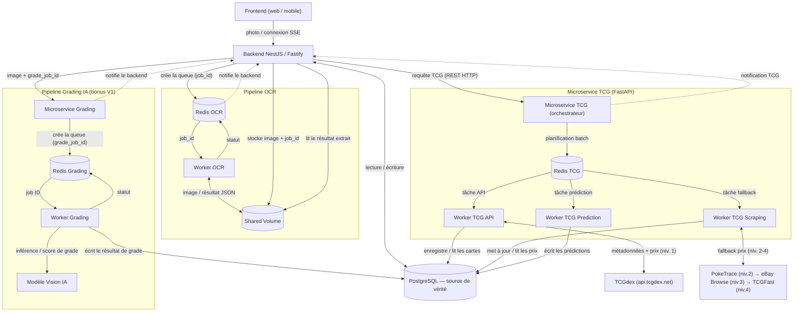

# Architecture des microservices — CollectionR

## Objectif

Ce document est le **point d'entrée** de la documentation des microservices de CollectionR. Il donne
la **vue d'ensemble** des pipelines d'arrière-plan et renvoie vers les documents détaillés
(dossiers [`marketplace/`](marketplace/) et [`api/`](api/)).

Il est aligné sur l'architecture runtime
([03-flux-techniques-plateforme.md](../architecture/03-flux-techniques-plateforme.md)) et sur la
clean architecture backend ([clean-architecture.md](../backend/clean-architecture.md)).

---

## Vue d'ensemble

La plateforme s'appuie sur un **backend NestJS (adaptateur Fastify)** qui expose l'API aux clients et
**lit/écrit dans PostgreSQL**, et sur **trois pipelines d'arrière-plan** orchestrés via des files
**Redis** dans un cluster **K3s** :

| Pipeline | Rôle | Statut |
|----------|------|--------|
| **Microservice TCG** | Synchronise les **cartes** (métadonnées) et collecte les **prix** ; prédit les prix | V1 |
| **Pipeline OCR** | Reconnaît une carte à partir d'une **photo** (scan) | V1 |
| **Pipeline Grading IA** | Pré-gradation (état/centrage) par **vision IA** | **Bonus V1** |

> **Principe clé :** **PostgreSQL est l'unique source de vérité**. Tous les workers y **écrivent** ;
> le backend s'y connecte en **lecture/écriture** (données applicatives) et lit les **tables de prix** pour répondre aux clients. Les workers sont écrits en
> **Python** (cohérent avec le Pipeline de Données Python) ; ils n'exposent **aucune API REST**. Seul
> l'**orchestrateur** (Microservice TCG) expose un unique endpoint **REST interne** (**FastAPI**) pour
> recevoir le déclenchement du backend — jamais exposé aux clients.

---

## Schéma global



---

## 1. Microservice TCG

Reçoit la planification du backend via un **appel REST HTTP** (endpoint **FastAPI** unique,
`POST /sync`), puis orchestre **trois workers** via `Redis TCG` (**Redis Streams**,
`XADD`/`XREADGROUP`) :

- **Worker TCG API** — synchronise métadonnées + prix agrégés depuis **TCGdex** (niveau 1).
  Catalogue **français et anglais** dès la V1 (japonais hors périmètre V1).
- **Worker TCG Scraping** — cascade de fallback quand TCGdex est indisponible :
  **PokeTrace** (niveau 2 — prix EUR Cardmarket + USD TCGPlayer/eBay, ventilation par état et grade
  PSA/BGS/CGC, freemium 250 req/jour) → **eBay Browse API** (niveau 3 — annonces actives USD) →
  **TCGFast Trader** (niveau 4 — prix USD + gradés + historique, 14,99 $/mois). Aucun scraping.
- **Worker TCG Prediction** — estime les prix (IA) à partir de l'historique (`price_history`).

Les trois écrivent dans **PostgreSQL**. Détails : [`marketplace/marketplace-scraper.md`](marketplace/marketplace-scraper.md),
[`marketplace/decision-technique.md`](marketplace/decision-technique.md),
[`marketplace/bibliotheque-scraping.md`](marketplace/bibliotheque-scraping.md).

## 2. Pipeline OCR

Reconnaissance de carte à partir d'une photo : le backend stocke l'image dans un **Shared Volume**
avec un `job_id`, planifie via `Redis OCR`, le **Worker OCR** lit l'image et écrit le résultat, puis
notifie le backend (suivi via **SSE**). Les fichiers temporaires sont supprimés après traitement.

## 3. Pipeline Grading IA (bonus V1)

Pré-gradation (état/centrage) : le backend envoie l'image au **Microservice Grading** avec un
`grade_job_id`, planifié via `Redis Grading` ; le **Worker Grading** réalise l'**inférence** via un
**Modèle Vision IA** et écrit le **score de grade** en base. Composant **bonus** de la V1.

---

## Structure de dossiers — Microservice TCG (Python)

Convention proposée, alignée sur la Clean Architecture du backend
([clean-architecture.md](../backend/clean-architecture.md)) : un seul package Python partagé par
l'orchestrateur et les 3 workers, avec des points d'entrée séparés dans `interface/`.

```
services/tcg/
├── requirements.txt           # fastapi, redis, httpx, pydantic, psycopg[binary], tenacity, aiolimiter
├── requirements-dev.txt       # pytest, pytest-cov, respx
├── .venv/                    # environnement virtuel local, jamais commité (.gitignore)
├── src/
│   └── tcg_service/
│       ├── domain/
│       │   ├── entities/     # CardPrice, PriceHistory, CollectLog — dataclasses pures
│       │   └── ports/        # PriceProviderPort, PriceRepositoryPort, QueuePort
│       ├── application/
│       │   ├── sync_cards.py
│       │   ├── collect_fallback_prices.py
│       │   └── predict_price.py
│       ├── infrastructure/
│       │   ├── providers/    # TCGdexProvider, PokeTraceProvider, EbayBrowseProvider, TCGFastProvider
│       │   ├── persistence/  # PsycopgPriceRepository
│       │   ├── queue/        # RedisStreamsQueue (XADD / XREADGROUP / XACK)
│       │   └── prediction/   # chargement / inférence du modèle IA
│       └── interface/
│           ├── api/          # FastAPI — seul point d'entrée HTTP (POST /sync)
│           └── workers/      # worker_api.py, worker_scraping.py, worker_prediction.py
└── tests/
```

**Setup local (venv)** :

```bash
python -m venv .venv
.venv\Scripts\activate        # Windows — Git Bash : source .venv/Scripts/activate
pip install -r requirements.txt -r requirements-dev.txt
```

`domain/` n'importe **aucun framework** (ni FastAPI, ni psycopg, ni redis, ni pydantic) — même
discipline que le backend TypeScript. **FastAPI n'apparaît que dans `interface/api/`** (l'orchestrateur,
`POST /sync`) ; les 3 workers dans `interface/workers/` n'en dépendent jamais, ils ne font que
consommer Redis TCG et écrire en PostgreSQL.

---

## Principes transverses

- **PostgreSQL = source de vérité** ; tous les workers y écrivent (via `psycopg 3`, UPSERT
  idempotents), le backend lit.
- **Files Redis dédiées** par pipeline (`Redis TCG`, `Redis OCR`, `Redis Grading`) — planification,
  pas de stockage métier. `Redis TCG` utilise des **Redis Streams** (consumer groups) : `ioredis`
  (Node, côté backend/orchestrateur) et `redis-py` (Python, côté workers) parlent nativement le
  même protocole.
- **Microservice TCG (orchestrateur)** : seul composant du pipeline TCG à exposer une route —
  un endpoint **REST interne (FastAPI)** appelé uniquement par le backend, jamais par les clients.
- **K3s** : chaque composant est un **Pod** ; clés externes en **Secrets**, isolation via
  **NetworkPolicies**, redémarrage automatique des Pods.
- **Workers Python** découplés du **backend NestJS (Fastify)** ; aucun worker n'expose d'API REST.
- **Aucune image stockée localement** côté TCG (URLs uniquement) ; le Shared Volume OCR est
  temporaire.

---

## Conformité (CGU) — l'essentiel

- **Métadonnées** : TCGdex (**MIT**) — libres avec attribution + disclaimer non-affiliation Nintendo.
- **Prix TCGdex** : relaie Cardmarket/TCGPlayer → **CGU sources en amont** s'appliquent ; affichage
  indicatif OK en phase étudiante (mention source obligatoire) ; licence commerciale requise au GO.
- **Prix PokeTrace** : freemium (250 req/jour gratuit, plan Pro 10 000/jour) ; prix EUR Cardmarket
  + USD TCGPlayer/eBay avec ventilation par état (NM, LP…) et grade (PSA/BGS/CGC) ; vérifier CGU
  commerciales avant passage GO.
- **Prix eBay Browse API** : usage conforme au programme développeur officiel (annonces actives).
- **Prix TCGFast Trader** : usage commercial explicitement autorisé par le plan Trader (14,99 $/mois).
- **Cascade officielle** : TCGdex (niv. 1) → PokeTrace (niv. 2) → eBay Browse API (niv. 3) →
  TCGFast (niv. 4) → cache PostgreSQL (filet permanent).
- **Sources supprimées** : pokemontcg.io (devenu payant), JustTCG, PokéWallet ; APIs Cardmarket et
  TCGPlayer directes (inaccessibles aux nouveaux développeurs depuis 2024-2025).
- **À bannir** : scraping de Cardmarket/eBay/TCGPlayer (Cloudflare Enterprise + CGU), redistribution
  des prix bruts.
- Détail complet : [`marketplace/marketplace-scraper.md`](marketplace/marketplace-scraper.md) (§11).

---

## Organisation de la documentation

```text
docs/microservices/
├── architecture_microservices.md   ← ce document (vue d'ensemble)
├── marketplace/                     ← collecte des prix & scraping
│   ├── marketplace-scraper.md       ← doc central du Microservice TCG
│   ├── decision-technique.md        ← stratégie de collecte
│   └── bibliotheque-scraping.md     ← bibliothèques Python
└── api/                             ← intégrations API
    ├── externe-api.md               ← API TCGdex (métadonnées + prix)
    └── collectionr-api.md           ← API CollectionR exposée aux clients
```

---

## Sources & références

- **Schéma** basé sur l'architecture runtime : [03-flux-techniques-plateforme.md](../architecture/03-flux-techniques-plateforme.md) et la clean architecture backend : [clean-architecture.md](../backend/clean-architecture.md).
- **Sources externes détaillées** (APIs, CGU, prix, anti-bot, RSS) : voir les sections « Sources » de [marketplace/marketplace-scraper.md](marketplace/marketplace-scraper.md), [marketplace/decision-technique.md](marketplace/decision-technique.md), [marketplace/bibliotheque-scraping.md](marketplace/bibliotheque-scraping.md) et [api/externe-api.md](api/externe-api.md).
- **Stratégie de tests** : Document QA — Plan de Test v1.4 (document projet).
