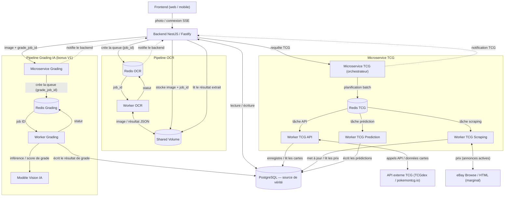

# Architecture des microservices — CollectionR

## Objectif

Ce document est le **point d'entrée** de la documentation des microservices de CollectionR. Il donne
la **vue d'ensemble** des pipelines d'arrière-plan et renvoie vers les documents détaillés
(dossiers [`marketplace/`](marketplace/) et [`api/`](api/)).

Il est aligné sur l'architecture runtime
([03-flux-techniques-plateforme.md](../architecture/03-flux-techniques-plateforme.md)) et sur la
clean architecture backend ([clean-architecture.md](../backend/clean-architecture.md)).

---

## Vue d'ensemble

La plateforme s'appuie sur un **backend NestJS (adaptateur Fastify)** qui expose l'API aux clients et
**lit/écrit dans PostgreSQL**, et sur **trois pipelines d'arrière-plan** orchestrés via des files
**Redis** dans un cluster **K3s** :

| Pipeline | Rôle | Statut |
|----------|------|--------|
| **Microservice TCG** | Synchronise les **cartes** (métadonnées) et collecte les **prix** ; prédit les prix | V1 |
| **Pipeline OCR** | Reconnaît une carte à partir d'une **photo** (scan) | V1 |
| **Pipeline Grading IA** | Pré-gradation (état/centrage) par **vision IA** | **Bonus V1** |

> **Principe clé :** **PostgreSQL est l'unique source de vérité**. Tous les workers y **écrivent** ;
> le backend s'y connecte en **lecture** pour répondre aux clients. Les workers sont écrits en
> **Python** (cohérent avec le Pipeline de Données Python) ; ils n'exposent **aucune API REST**.

---

## Schéma global



---

## 1. Microservice TCG

Orchestre **trois workers** via `Redis TCG` (BullMQ) :

- **Worker TCG API** — synchronise métadonnées + prix agrégés depuis les **APIs ouvertes** (TCGdex,
  pokemontcg.io).
- **Worker TCG Scraping** — collecte de prix **API-first**, scraping HTML en **dernier recours**
  encadré (eBay marginal ; jamais Cardmarket/TCGPlayer).
- **Worker TCG Prediction** — estime les prix (IA) à partir de l'historique (`price_history`).

Les trois écrivent dans **PostgreSQL**. Détails : [`marketplace/marketplace-scraper.md`](marketplace/marketplace-scraper.md),
[`marketplace/decision-technique.md`](marketplace/decision-technique.md),
[`marketplace/bibliotheque-scraping.md`](marketplace/bibliotheque-scraping.md).

## 2. Pipeline OCR

Reconnaissance de carte à partir d'une photo : le backend stocke l'image dans un **Shared Volume**
avec un `job_id`, planifie via `Redis OCR`, le **Worker OCR** lit l'image et écrit le résultat, puis
notifie le backend (suivi via **SSE**). Les fichiers temporaires sont supprimés après traitement.

## 3. Pipeline Grading IA (bonus V1)

Pré-gradation (état/centrage) : le backend envoie l'image au **Microservice Grading** avec un
`grade_job_id`, planifié via `Redis Grading` ; le **Worker Grading** réalise l'**inférence** via un
**Modèle Vision IA** et écrit le **score de grade** en base. Composant **bonus** de la V1.

---

## Principes transverses

- **PostgreSQL = source de vérité** ; tous les workers y écrivent (via `psycopg 3`, UPSERT
  idempotents), le backend lit.
- **Files Redis dédiées** par pipeline (`Redis TCG`, `Redis OCR`, `Redis Grading`) — planification,
  pas de stockage métier.
- **K3s** : chaque composant est un **Pod** ; clés externes en **Secrets**, isolation via
  **NetworkPolicies**, redémarrage automatique des Pods.
- **Workers Python** découplés du **backend NestJS (Fastify)** ; aucun worker n'expose d'API REST.
- **Aucune image stockée localement** côté TCG (URLs uniquement) ; le Shared Volume OCR est
  temporaire.

---

## Conformité (CGU) — l'essentiel

- **Métadonnées** : TCGdex (**MIT**) — libres avec attribution + disclaimer non-affiliation Nintendo.
- **Prix** : relayés (Cardmarket/TCGPlayer) → **CGU sources en amont** ; affichage à des tiers
  restreint, **palier payant à licence commerciale** requis pour le commercial.
- **À bannir** : scraping Cardmarket/eBay/TCGPlayer, redistribution des prix bruts.
- Détail complet : [`marketplace/marketplace-scraper.md`](marketplace/marketplace-scraper.md) (§11).

---

## Organisation de la documentation

```text
docs/microservices/
├── architecture_microservices.md   ← ce document (vue d'ensemble)
├── marketplace/                     ← collecte des prix & scraping
│   ├── marketplace-scraper.md       ← doc central du Microservice TCG
│   ├── decision-technique.md        ← stratégie de collecte
│   └── bibliotheque-scraping.md     ← bibliothèques Python
└── api/                             ← intégrations API
    ├── externe-api.md               ← API TCGdex (métadonnées + prix)
    └── collectionr-api.md           ← API CollectionR exposée aux clients
```

---

## Sources & références

- **Schéma** basé sur l'architecture runtime : [03-flux-techniques-plateforme.md](../architecture/03-flux-techniques-plateforme.md) et la clean architecture backend : [clean-architecture.md](../backend/clean-architecture.md).
- **Sources externes détaillées** (APIs, CGU, prix, anti-bot, RSS) : voir les sections « Sources » de [marketplace/marketplace-scraper.md](marketplace/marketplace-scraper.md), [marketplace/decision-technique.md](marketplace/decision-technique.md), [marketplace/bibliotheque-scraping.md](marketplace/bibliotheque-scraping.md) et [api/externe-api.md](api/externe-api.md).
- **Stratégie de tests** : Document QA — Plan de Test v1.4 (document projet).
