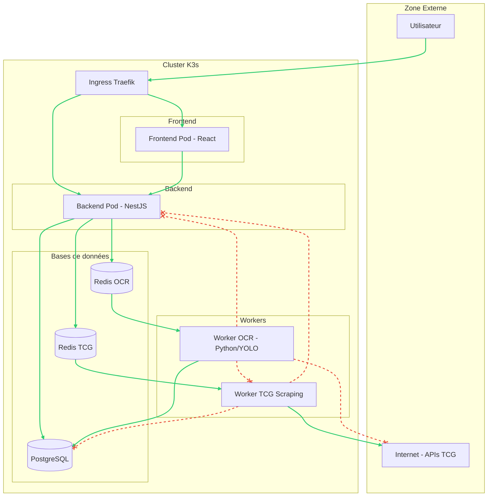
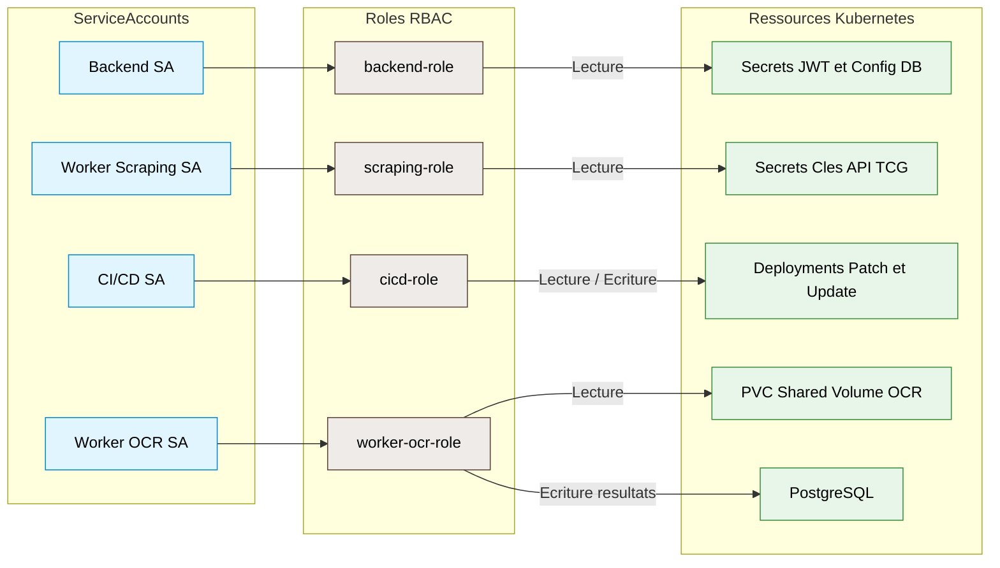

# Réseaux & IAM — CollectionR

## Sommaire

1. [Objectif](#1-objectif)
2. [Architecture Réseau (K3s)](#2-architecture-réseau-k3s)
    * [2.1 Ingress Controller & Exposition](#21-ingress-controller--exposition)
    * [2.2 Segmentation par NetworkPolicies](#22-segmentation-par-networkpolicies)
    * [2.3 Résolution DNS & Flux Internes](#23-résolution-dns--flux-internes)
    * [2.4 Sécurisation des Flux (HTTPS/TLS)](#24-sécurisation-des-flux-httpstls)
3. [Identity & Access Management (IAM)](#3-identity--access-management-iam)
    * [3.1 RBAC Kubernetes (Contrôle d'accès)](#31-rbac-kubernetes-contrôle-daccès)
    * [3.2 Identité des Services (ServiceAccounts)](#32-identité-des-services-serviceaccounts)
    * [3.3 Accès Développeurs & Administrateurs](#33-accès-développeurs--administrateurs)
4. [Gestion des Secrets et des Variables d'Environnement](#4-gestion-des-secrets-et-des-variables-denvironnement)
    * [4.1 Injection de Secrets Kubernetes](#41-injection-de-secrets-kubernetes)
    * [4.2 Centralisation (Vault)](#42-centralisation-vault)
5. [Sécurité & Audit](#5-sécurité--audit)
    * [5.1 Audit des accès réseau](#51-audit-des-accès-réseau)
    * [5.2 Limitation de la surface d'attaque](#52-limitation-de-la-surface-dattaque)
6. [Évolution future](#6-évolution-future)
7. [Documents associés](#7-documents-associés)

---

## 1. Objectif

Ce document définit l'architecture réseau et la gestion des accès (IAM) de l'infrastructure Cloud. L'objectif est de garantir une isolation stricte des composants, une gestion sécurisée des identités et une exposition contrôlée des services, tout en respectant la contrainte de **budget 0€**.

Cette couche "Infrastructure" complète la sécurité applicative définie dans le document `S03-api-security.md`.

---

## 2. Architecture Réseau (K3s)

Le réseau du cluster repose sur les primitives natives de K3s (Flannel comme CNI par défaut).

### 2.1 Ingress Controller & Exposition

L'exposition des services vers l'extérieur est centralisée via l'Ingress Controller **Traefik** (inclus dans K3s).

*   **Point d'entrée unique :** Seul le port 80/443 de l'Ingress est exposé.
*   **Routage :** Les `Ingress` Kubernetes orientent le trafic vers le Frontend (React) ou le Backend (NestJS) en fonction du domaine/chemin.
*   **Sécurité Ingress :** Utilisation de middlewares Traefik pour le rate limiting au niveau réseau et la sécurisation des headers.

### 2.2 Segmentation par NetworkPolicies

Pour appliquer le principe de **Zero Trust**, des `NetworkPolicies` isolent les flux entre les Pods :

| Flux | Politique | Raison |
| :--- | :--- | :--- |
| **Frontend → Backend** | Autorisé (via Ingress ou interne) | Communication nécessaire. |
| **Backend → Redis/PostgreSQL** | Autorisé | Persistance et Files d'attente. |
| **Worker OCR (Python/YOLO)** | **Bloqué** | Protection contre l'exfiltration de données (traitement local). |
| **Worker Scraping** | Autorisé (Sortant uniquement) | Nécessaire pour le scraping TCG (Cardmarket, TCGPlayer). |
| **Inter-Workers** | Bloqué | Aucun worker ne doit communiquer avec un autre worker. |

Voici le schéma corrigé avec ses couleurs et sans emojis :

### 2.3 Résolution DNS & Flux Internes

*   **CoreDNS :** Gère la résolution de noms interne (ex: `postgres-service.default.svc.cluster.local`).
*   **Redis OCR et Redis TCG : points de pivot centraux** pour les flux asynchrones. Le Backend y dépose des jobs, les Workers les récupèrent. Les `NetworkPolicies` autorisent les Workers à accéder **uniquement** à l'instance Redis dédiée.

### 2.4 Sécurisation des Flux (HTTPS/TLS)

*   **Cert-manager :** Déployé sur K3s pour automatiser la génération de certificats.
*   **Production/Staging :** Utilisation de **Let's Encrypt** (Gratuit) pour obtenir des certificats SSL valides.
*   **Développement Local :** Certificats auto-signés ou communication HTTP simple derrière le proxy Ingress.

### 2.5 Stockage Persistant & Isolation (Volumes)

Le pipeline OCR nécessite un stockage temporaire pour les images.
*   **PersistentVolumeClaim (PVC) :** Un volume est monté uniquement sur les Pods du **Backend** (écriture) et des **Workers OCR** (lecture).
*   **Isolation :** Aucun autre service (ex: Scraping, Database) n'a accès à ce volume.
*   **Cycle de vie :** Les images sont supprimées automatiquement après traitement (ou via un cron de nettoyage) pour limiter l'utilisation disque.

---

## 3. Identity & Access Management (IAM)

### 3.1 RBAC Kubernetes (Contrôle d'accès)

L'accès aux ressources du cluster est régi par le **RBAC** (Role-Based Access Control) :

*   **Roles & ClusterRoles :** Définissent les actions autorisées (get, list, create, delete) sur les ressources (pods, secrets, services).
*   **RoleBindings :** Associent ces rôles à des utilisateurs ou des services.

### 3.2 Identité des Services (ServiceAccounts)

Chaque microservice s'exécute avec son propre **ServiceAccount** :

*   **Backend SA :** Peut lire certains Secrets (ex: clés JWT).
*   **Worker OCR SA :** Accès limité au PVC Shared Volume OCR
(lecture des images) et à PostgreSQL (écriture des résultats).
Ne peut pas lister les autres pods ni accéder aux secrets.
*   **Worker Scraping SA :** Peut accéder aux Secrets contenant les clés API Cardmarket et TCGPlayer.
*   **CI/CD SA :** Privilèges limités au déploiement (patch des deployments, update des images).

### 3.3 Accès Développeurs & Administrateurs

*   **Accès Nominatifs :** Chaque membre de l'équipe infra possède son propre fichier `kubeconfig`.
*   **Moindre Privilège :** Les développeurs n'ont pas accès aux Secrets de production.
Seule l'équipe Cloud / DevOps dispose des droits d'accès
complets au cluster — voir section 3.2.

---

## 4. Gestion des Secrets et des Variables d'Environnement

### 4.1 Injection de Secrets Kubernetes

Les informations sensibles (mots de passe DB, clés API Cardmarket/TCGPlayer) ne sont **jamais** stockées en clair dans Git.

*   **Kubernetes Secrets :** Créés manuellement ou via la CI/CD (GitHub Actions Secrets).
*   **Injection :** Les variables d'environnement sont injectées dans les Pods via `secretKeyRef`.

### 4.2 Centralisation des secrets (Vault)

Pour la gestion centralisée des secrets entre les environnements :
- **Développement et staging** : Kubernetes Secrets natifs,
  créés manuellement ou via GitHub Actions Secrets.
- **Production** : évolution prévue vers **Vault** pour
  centraliser les secrets, auditer les accès et gérer
  la rotation automatique — voir `D01-environnement.md`
  section 5.2.

---

## 5. Sécurité & Audit

### 5.1 Audit des accès réseau

*   **Logs Traefik :** Journalisation de toutes les requêtes entrantes (IP, Path, Status Code).
*   **Audit Logs Kubernetes :** Monitoring des modifications sur le cluster (qui a modifié quel Deployment ?).

### 5.2 Limitation de la surface d'attaque

*   **Images Minimalistes :** Utilisation de bases `alpine` ou `distroless` pour réduire les vulnérabilités.
*   **SecurityContext :** Les Pods tournent en `non-root` avec `allowPrivilegeEscalation: false` autant que possible.
*   **Exposition sélective :** Seuls les services strictement nécessaires au client (Web/API) ont un Ingress associé.

## 6. Évolution future

**Court terme — K3s local**
- NetworkPolicies définies et versionnées dans Git
- Certificats auto-signés en développement local
- Kubernetes Secrets natifs pour la gestion des secrets

**Moyen terme — K3s VPS staging**
- Activation de Let's Encrypt via Cert-manager
- Audit logs Kubernetes activés
- Revue des ServiceAccounts et RBAC par l'équipe Cloud

**Long terme — production**
- Migration des secrets vers Vault
- Durcissement des SecurityContext sur tous les Pods
- Audit de sécurité externe recommandé avant ouverture publique

Egalement pour rester en cohérence avec tous les autres fichiers, rajoute cette section : 

## 7. Documents associés

- `A03-architecture-runtime.md`
- `S01-principes-securite.md`
- `S03-api-security.md`
- `S05-logs-audit.md`
- `D01-environnement.md`
- `D02-cicd.md`
